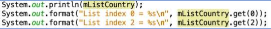
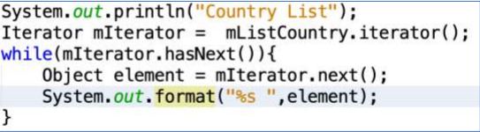

# Laporan Praktikum #12 - Java API

## Kompetensi

- Memahami cara penyimpanan objek menggunakan Collection dan Map. 
- Mengetahui pengelompokan dari Collection. 
- Mengetahui perbedaan dari interface Set, List dan Map. 
- Mengetahui penggunaan class-class dari interface Set, List, dan Map.
- Memahami koneksi database menggunakan JDBC dan JDBC API 

## Ringkasan Materi

1. *Collection*

Suatu objek yang bisa digunakan untuk menyimpan sekumpulan objek serta, Objek yang ada dalam Collection disebut elemen.
Class-class mengenai Collection tergabung dalam Java Collection Framework. 

Collection terbagi menjadi 3 kelompok yaitu 

- *Set*

    Dimana objek/anggota yang tersimpan dalam Set harus unik. Urutan maupun letak dari anggota tidak penting, hanya keberadaan anggota saja yang penting.

    HashSet dapat digunakan untuk menyimpan elemen-elemen bebas-duplikat. Kelas HashSet merupakan suatu kelas konkrit yang mengimplementasikan Set. 

    Pembuatan objek HashSet adalah sebagai berikut: 

    **Set <nama_objek_HashSet> = new HashSet();**

- *List*

    Untuk menyimpan sekumpulan objek berdasarkan urutan masuk (ordered) dan menerima duplikat.Oleh sebab itu memiliki posisi awal dan posisi akhir, menyisipkan objek pada posisi tertentu, mengakses dan menghapus isi list, dimana semua proses ini selalu didasarkan pada urutannya. 

    Class-class yang mengimplementasikan interface List adalah Vector, Stack, Linked List dan Array List. Pada jobsheet ini yang akan dibahas adalah ArrayList.

    ArrayList digunakan untuk membuat array yang ukurannya dinamis. Berbeda dengan array biasa yang ukurannya harus ditentukan di awal deklarasi array, dengan ArrayList, ukurannya akan fleksibel tergantung banyaknya elemen yang dimasukkan. 

    Pembuatan objek ArrayList adalah sebagai berikut: 

    **ArrayList <nama_objek_arraylist>=new ArrayList();**

- *Map*

    Perbedaaan mendasar map dengan collection yang lain, untuk menyimpan objek pada Map, perlu sepasang objek, yaitu key yang bersifat unik dan nilai yang disimpan. Untuk mengakses nilai tersebut maka kita perlu mengetahui key dari nilai tersebut. Map juga dikenal sebagai dictionary/kamus. Pada saat menggunakan kamus, perlu suatu kata yang digunakan untuk pencarian. Class-class yang mengimplementasikan Map adalah Hashtable,HashMap, LinkedHashMap. Pada jobsheet ini yang akan dibahas adalah HashMap. 

    HashMap adalah class implementasi dar Map, Map itu sendiri adalah interface yang memiliki fungsi untuk memetakan nilai dengan key unik.

    HashMap berfungsi sebagai memory record management, dimana setiap record dapat disimpan dalam sebuah Map. kemudian setiap Map diletakkan pada vektor, list atau set yang masih turunan dari collection.

    Pembuatan objek HashMap adalah sebagai berikut: 

    **HashMap <nama_objek_HashMap> = new HashMap();**

## Percobaan

### Percobaan 1 : Set

`Screenshot:`


`Kode Program:`

- Kode Program HelloGui : [Klik disini](../../src/12_Java_API/Percobaan1/CobaHashSet1841720085Falaah)

`Pertanyaan`
1. Apakah fungsi potongan program dibawah ini! 



Jawab :

Fungsi import `java.util.*` adalah meng-import semua library java.util yang kemudian bisa mengimplementasikan method atau method yang bisa diakses dari library tersebut.

2. Ganti potongan program pada soal no 1 menjadi sebagai berikut 




### Percobaan 2 : Menangani Input Pada GUI 

`Screenshot:`


`Kode Program:`

- Kode Program MyInputForm : [Klik disini](../../src/11_GUI/Percobaan2/MyInputForm1841720085Falaah.java)

`Pertanyaan`

1. Modifikasi kode program dengan menambahkan JButton baru untuk melakukan fungsi
perhitungan penambahan, sehingga ketika button di klik (event click) maka akan
menampilkan hasil penambahan dari nilai A dan B

`Jawab`


- Kode Program MyInputForm : [Klik disini](../../src/11_GUI/Percobaan2/Pertanyaan/MyInputForm1841720085Falaah_edit.java)

### Percobaan 3 : Manajemen Layout

`Screenshot:`


`Kode Program:`

- Kode Program Border : [Klik disini](../../src/11_GUI/Percobaan3/Border1841720085Falaah.java)
- Kode Program Box : [Klik disini](../../src/11_GUI/Percobaan3/Box1841720085Falaah.java)
- Kode Program Grid : [Klik disini](../../src/11_GUI/Percobaan3/Grid1841720085Falaah.java)
- Kode Program LayoutGUI : [Klik disini](../../src/11_GUI/Percobaan3/LayoutGUI1841720085Falaah.java)

`Pertanyaan`

1. Apa perbedaan dari Grid Layout, Box Layout dan Border Layout?
2. Apakah fungsi dari masing-masing kode berikut?

    

`Jawab`

1. Perbedaan:

   - Grid layout menampilkan/membagi layout menjadi seperti tabel yaitu baris dan kolom
   - Box layout menampikan/membagi layout dalam satu kolom
   - Border layout membagi layout menjadi 5 bagian yaitu north, east, sout, west, center

2. Fungsi:

    - setDefaultCloseOperation : untuk mengatur/memilih cara pehentian program
    - JFrame.EXIT_ON_CLOSE : untuk menghentikan program jika menekan tombol close
    - setVisible: menampilkan frame

### Percobaan 4 : Membuat GUI Melalui IDE Netbeans

`Screenshot:`


`Kode Program:`

- Kode Form Swing : [Klik disini](../../src/11_GUI/Percobaan4/Swing1841720085Falaah.form)
- Kode Program Swing :[Klik disini](../../src/11_GUI/Percobaan4/Swing1841720085Falaah.java)

`Pertanyaan`

1. Apakah fungsi dari kode berikut?

    
    
2. Mengapa pada bagian logika checkbox dan radio button digunakan multiple if ?
3. Lakukan modifikasi pada program untuk melakukan menambahkan inputan berupa alamat dan berikan fungsi pemeriksaan pada nilai Alamat tersebut jika belum diisi dengan menampilkan pesan peringatan

`Jawab`

1. Berguna untuk membuat, menjalankan dan menampilan form yang dibuat.
2. Sebab, setiap checkbok atau radiobutton memiliki isi yang berbeda
3. Kode:

    

    ```
     private void cmdtampilActionPerformed(java.awt.event.ActionEvent evt) {                                          
        // TODO add your handling code here:
        nama = txtname.getText();
        nim = txtnim.getText();
        alamat = txtalamat.getText();
        if (cbMK1.isSelected()) {
            matakuliah = "Sistem terdistribusi";
        }
        if (cbMK2.isSelected()) {
            matakuliah = "PBO";
        }

        if (rdjeniskelamin1.isSelected()) {
            jeniskelamin = "Laki-laki";
        }
        if (rdjeniskelamin2.isSelected()) {
            jeniskelamin = "Perempuan";
        }

        jurusan = listjurusan.getSelectedValue().toString();
        semester = comboboxsemester.getSelectedItem().toString();

        info = "Nama      : " + nama + "\n";
        info += "NIM      : " + nim + "\n";
        info += "Jenis Kelamin        : " + jeniskelamin + "\n";
        info += "Jurusan      : " + jurusan + "\n";
        info += "Semester     : " + semester + "\n";
        info += "Mata Kuliah      : " + matakuliah + "\n";
        info += "Alamat       : " + alamat + "\n";
        hasil.setText(info);
        if (txtalamat.getText().equals("")) {
            JOptionPane.showMessageDialog(null, "Alamat Masih Kosong");
        }
    }                                          

    ```

### Percobaan 5 : JTabPane, JTtree, JTable 

`Screenshot:`


`Kode Program:`

* Kode Form Swing2 : [Klik disini](../../src/11_GUI/Percobaan5/Swing2_1841720085Falaah.form)
* Kode Program Swing2 : [Klik disini](../../src/11_GUI/Percobaan5/Swing2_1841720085Falaah.java)

`Pertanyaan`

1. Apa kegunaan komponen swing JTabPane, JTtree, pada percobaan 5?
2. Modifikasi program untuk menambahkan komponen JTable pada tab Halaman 1 dan tab Halaman 2

`Jawab`

1. Fungsi:

    - JTabPane: untuk membuat panel berbentuk tab atau halaman
    - JTree: untuk menampilkan data dengan hirarki properti dengan menambahkan node ke node dan menyimpan konsep induk dan anak node

2. Hasil

   

## Tugas

`Screenshot:`


`Kode Program:`

* Kode Form Kalkulator : [Klik disini](../../src/11_GUI/Tugas/Kalkulator1841720085Falaah.form)
* Kode Program Kalkulaotr : [Klik disini](../../src/11_GUI/Tugas/Kalkulator1841720085Falaah.java)

## Kesimpulan

* Mempelajari apa itu JFrame.
* Mempelajari Menangani Input Pada GUI.
* Mempelajari bagaimana Manajemen Border Layout, Grid Layout, dan Box Layout.
* Mempelajari bagaimana cara Membuat GUI Melalui IDE Netbeans.
* Mempelajari pembuatan JTabPane, JTtree, JTable.
* Mempelajari cara membuat kalkulator sederhana dengan GUI.

## Pernyataan Diri

Saya menyatakan isi tugas, kode program, dan laporan praktikum ini dibuat oleh saya sendiri. Saya tidak melakukan plagiasi, kecurangan, menyalin/menggandakan milik orang lain.

Jika saya melakukan plagiasi, kecurangan, atau melanggar hak kekayaan intelektual, saya siap untuk mendapat sanksi atau hukuman sesuai peraturan perundang-undangan yang berlaku.

Ttd,

***(Muhammad Falaah Azmi)***