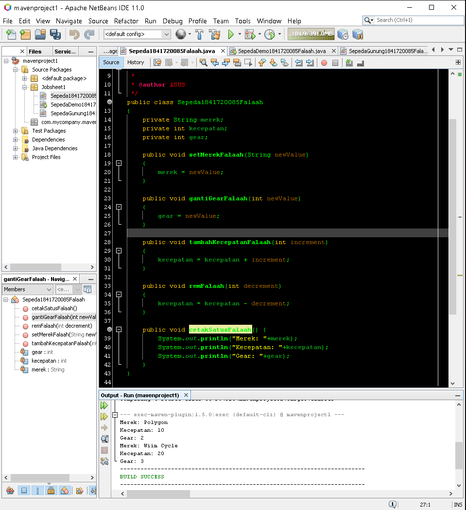

# Laporan Praktikum #1 - Pengantar Konsep PBO

## Kompetensi

1. Perbedaan paradigma berorientasi objek dengan paradigma struktural 
2. Konsep dasar PBO 

## Ringkasan Materi

### Pendahuluan
OOP (Object Oriented Programming) adalah suatu metode pemrograman yang berorientasi kepada objek. Tujuan dari OOP diciptakan adalah untuk mempermudah pengembangan program dengan cara mengikuti model yang telah ada di kehidupan sehari-hari. 

Perbedaan dari OOP dengan Pemrograman terstruktur adalah dimana program pada OOP di pecah menjadi "Objek" yang membungkus "state" dan "method", serta memiliki kelebihan berupa lebih fleksibel dan modularnya pemrograman OOP ini. Apabila, ada perubahan fitur di dalam "method" sudah dipastikan tidak akan terganggunya program secara keseluruhan dan lebih efisennya OOP dibandingkan pemrograman terstruktur.

### Konsep Dasar
1.  Object 
    
    Suatu rangkaian dalam program yang terdiri dari "state" dan "behaviour". "State" adalah ciri-ciri atau atribut dari objek tersebut dan "Behaviour" adalah perilaku yang dilakukan oleh object tersebut.
   
2.  Class
    
    Suatu blueprint atau cetakan untuk menciptakan suatu instant
    dari object. class juga merupakan grup suatu object dengan kemiripan
    attribute, behaviour dan relasi ke object lain.
 
3.  

## Percobaan 

### Percobaan 1

Link kode program Sepeda : [Klik disini](../../src/1_Pengantar_Konsep_PBO/Sepeda1841720085Falaah.java)

Link kode program SepedaDemo : [Klik disini](../../src/1_Pengantar_Konsep_PBO/SepedaDemo1841720085Falaah.java)

Penjelasan  :   

### Percobaan 2

Link kode program SepedaGunung : [Klik disini](../../src/1_Pengantar_Konsep_PBO/SepedaGunung1841720085Falaah.java)

Link kode program SepedaDemo : [Klik disini](../../src/1_Pengantar_Konsep_PBO/SepedaDemo1841720085Falaah.java)

Penjelasan  :   

## Kesimpulan

## Pertanyaan
1. Sebutkan dan jelaskan aspek-aspek yang ada pada pemrograman berorientasi objek! 
2. Apa yang dimaksud dengan object dan apa bedanya dengan class? 
3. Sebutkan salah satu kelebihan utama dari pemrograman berorientasi objek dibandingkan dengan pemrograman struktural! 
4. Pada class Sepeda, terdapat state/atribut apa saja? 
5. Tambahkan atribut warna pada class Sepeda. 
6. Mengapa pada saat kita membuat class SepedaGunung, kita tidak perlu membuat class nya dari nol? 

Jawab   :   

1.

2.

3.

4.

5.

6.

## Tugas

## Pernyataan Diri

Saya menyatakan isi tugas, kode program, dan laporan praktikum ini dibuat oleh saya sendiri. Saya tidak melakukan plagiasi, kecurangan, menyalin/menggandakan milik orang lain.

Jika saya melakukan plagiasi, kecurangan, atau melanggar hak kekayaan intelektual, saya siap untuk mendapat sanksi atau hukuman sesuai peraturan perundang-undangan yang berlaku.

Ttd,

(Muhammad Falaah Azmi)

