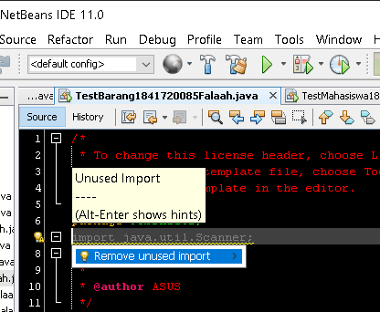
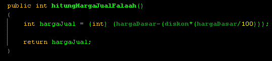
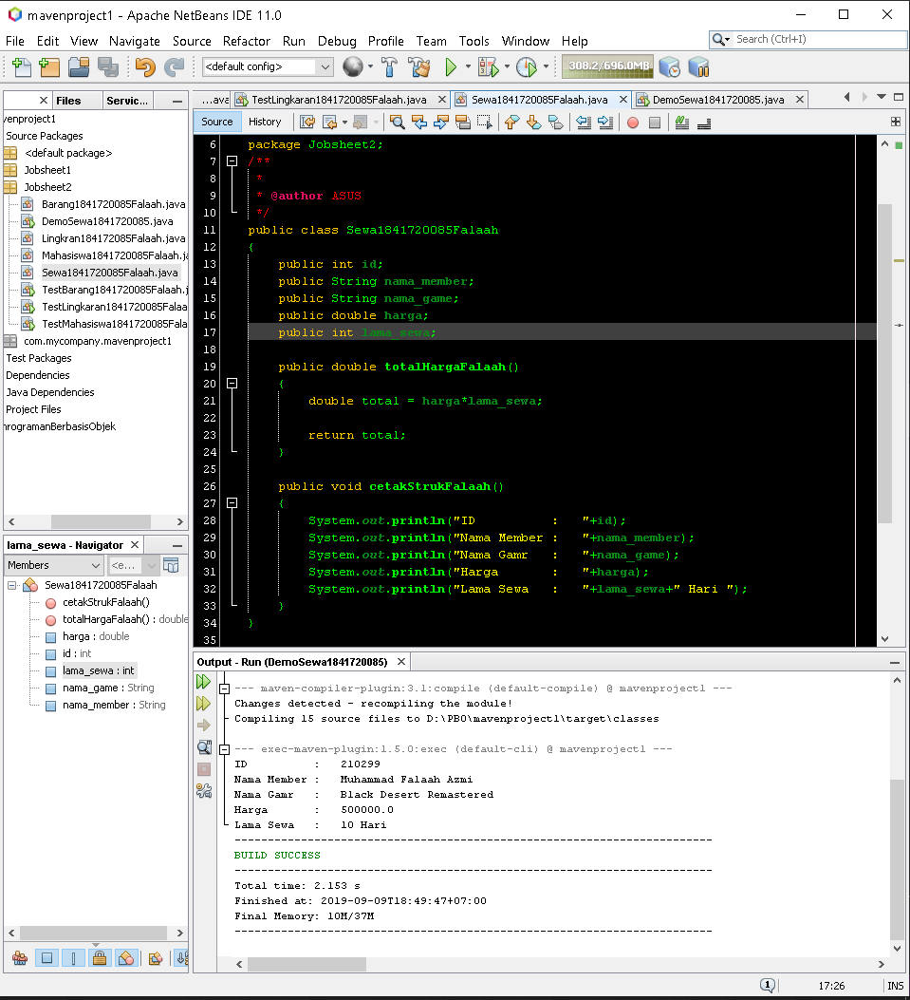

# Laporan Praktikum #2 - Class dan Object

## Kompetensi

1. Mahasiswa dapat memahami deskripsi dari class dan object
2. Mahasiswa memahami implementasi dari class
3. Mahasiswa dapat memahami implementasi dari attribute
4. Mahasiswa dapat memahami implementasi dari method
5. Mahasiswa dapat memahami implementasi dari proses instansiasi
6. Mahasiswa dapat memahami implementasi dari try-catch
7. Mahasiswa dapat memahami proses pemodelan class diagram menggunakan UML

## Ringkasan Materi

Pada Praktikum yang sudah saya mulai memahami apa itu class, attribute, method, object, try - catch, dan UML serta mengetahui aturan-aturan apa saja yang harus diperhatikan pada pembuatan ke 5 hal tersebut. Lalu, pada praktikum ini saya bingung dengan apa yang saya coba mengapa tidak dapat di-running di OOP namun bisa di-running di Dasar Pemrograman. Seperti

dan 

Dalam praktikum ini juga saya mulai mengerti bagaimana harus menggunaka return yang benar. Saya hanya tidak mengerti mengenai ke 2 hal diatas, yang pertama mengapa tidak bisa di running justru netBen meminta kita untuk menghapusnya dan yang kedua mengapa ada (int) didalam fungsinya.

## Percobaan 

### Percobaan 1

Pada percobaan pertama adalah membuat class diagram dari suatu studi kasus dan juga beberapa pertanyaan sebagai berikut :

Dalam suatu perusahaan salah satu data yang diolah adalah data karyawan. Setiap karyawan memiliki id, nama, jenis kelamin, jabatan, jabatan, dan gaji. Setiap mahasiswa juga bisa menampilkan data diri pribadi dan melihat gajinya. 
 
1. Gambarkan desain class diagram dari studi kasus 1!
2. Sebutkan Class apa saja yang bisa dibuat dari studi kasus 1!
3. Sebutkan atribut beserta tipe datanya yang dapat diidentifikasi dari masing-masing class dari studi kasus 1!
4. Sebutkan method-method yang sudah anda buat dari masing-masing class pada studi kasus 1

Jawab:

1. Gambar desain class diagram Karyawan

    

2. Karyawan

3. Atribut yang ada pada class diagram Karyawan antara lain :
   
   a. Atribut id dengan tipe data integer

   b. Atribut nama dengan tipe data String

   c. Atribut jenisKelamin dengan tipe data String

   d. Atribut jabatan dengan tipe data String

   e. Atribut gaji dengan tipe data double

4. terdapat dua method yang sudah saya buat yaitu :
   
   a. tampilBiodata

   b. tampilGaji

### Percobaan 2

Pada percobaan kedua adalah membuat suatu program dengan class diagram yang sudah disediakan pada jobsheet, yaitu class diagram dari Mahasiswa yang berisi atribut nim dengan tipe data integer, nama dengan tipe data String, alamat dengan tipe data String dan juga kelas dengan tipe data String. Selain itu terdapat method pada class diagram Mahasiswa yaitu tampilBiodata.

Link code class Mahasiswa : [Klik di sini](../../src/2_Class_dan_Object/Mahasiswa1841720085Falaah.java)

Link code class Test Mahasiswa : [Kllik disini](../../src/2_Class_dan_Object/TestMahasiswa1841720085Falaah.java)

### Percobaan 3

Pada percobaan ketiga, saya membuat class yang bernama Barang. Pada class Barang ini terdapat tiga atribut yaitu namaBarang, jenisBarang dan stok. selain atribut terdapat juga method pada class tersebut, yaitu tampilBarang dan juga tambahStok.

Link code class Barang : [Kllik disini](../../src/2_Class_dan_Object/Barang1841720085Falaah.java)

Link code class Test Barang : [Kllik disini](../../src/2_Class_dan_Object/TestBarang1841720085Falaah.java)

## Kesimpulan

Dari ke dua percobaan tersebut saya menyimpulkan bahwa return dimana kita tidak dapat menggunakannya sebagai pengidentifikasi. Ini digunakan untuk keluar dari suatu metode, dengan atau tanpa nilai.

## Tugas

1. Suatu toko persewaan video game salah satu yang diolah adalah peminjaman, dimana data yang dicatat ketika ada orang yang melakukan peminjaman adalah id, nama member, nama game, dan harga yang harus dibayar. Setiap peminjaman bisa menampilkan data hasil peminjaman dan harga yang harus dibayar. Buatlah class diagram pada studi kasus diatas! 
 
    Penjelasan:
  
    a. Harga yang harus dibayar diperoleh dari lama sewa x harga.

    b. Diasumsikan 1x transaksi peminjaman game yang dipinjam hanya 1 game saja.

    

2. Buatlah program dari class diagram yang sudah anda buat di no 1! 

    

    Link code class Sewa : [Kllik disini](../../src/2_Class_dan_Object/Sewa1841720085Falaah.java) 

    Link code class Demo Sewa : [Kllik disini](../../src/2_Class_dan_Object/DemoSewa1841720085Falaah.java) 

3. Program dari Class diagram Lingkaran

   

   Link code class Lingkaran : [Kllik disini](../../src/2_Class_dan_Object/Lingkran184172085Falaah.java) 

   Link code class Test Lingkaran : [Kllik disini](../../src/2_Class_dan_Object/TestLingkaran1841720085Falaah.java) 

4. Program Class diagram Barang

   Deskripsi / Penjelasan :
    
    a. Nilai atribut hargaDasar dalam Rupiah dan atribut diskon dalam %
    
    b. Method hitungHargaJual() digunakan untuk menghitung harga jual dengan perhitungan berikut ini: 
    
    **harga jual = harga dasar – (diskon x harga dasar)**

    

    Link code class Barangn : [Kllik disini](../../src/2_Class_dan_Object/TugasBarang1841720085Falaah.java) 

    Link code class Demo : [Kllik disini](../../src/2_Class_dan_Object/DemoTugasBarang1841720085Falaah.java) 

## Kesimpulan

 Hal dapat disimpulkan dari praktikum dan juga tugas yang telah dilakukan, berupa  bahwa suatu class diagram  adalah rancangan dasar pada suatu pembuatan program. Selain pada praktikum dan juga tugas terdapat method yang dapat mengembalikan nilai yang gunanya sendiri adalah 'return' dimana kita tidak dapat menggunakannya sebagai pengidentifikasi. 'return' digunakan untuk keluar dari suatu metode, dengan atau tanpa nilai. 'return' dapat digunakan dengan metode dalam dua cara

 1. Methods returning a value: Untuk metode yang menentukan jenis return, yang pernyataan return-nya harus diikuti oleh nilai return.
 2. Methods not returning a value : Untuk metode yang tidak mengembalikan nilai, pernyataan return dapat dilewati.

Serta bagaimana kita harus benar-benar teliti mengenai penulisan dan penggunaan fungsi yang sudah dipraktikan.

## Pernyataan Diri

Saya menyatakan isi tugas, kode program, dan laporan praktikum ini dibuat oleh saya sendiri. Saya tidak melakukan plagiasi, kecurangan, menyalin/menggandakan milik orang lain.

Jika saya melakukan plagiasi, kecurangan, atau melanggar hak kekayaan intelektual, saya siap untuk mendapat sanksi atau hukuman sesuai peraturan perundang-undangan yang berlaku.

Ttd,

(**Muhammad Falaah Azmi**)

