# Laporan Praktikum #3 - Enkapsulasi

## Kompetensi

Setelah melakukan percobaan pada modul ini, mahasiswa memahami konsep:

1. Konstruktor 
2. Akses Modifier
3. Atribut/method pada class 
4. Intansiasi atribut/method  
5. Setter dan getter
6. Memahami notasi pada UML Class Diagram 

## Ringkasan Materi

Saya mengalami kesusahan pada saat menentukan kapan dan mengapa kita menggunakan sebuah Akses Modifier untuk program kita.  

## Percobaan 

### Percobaan 1 - Enkapsulasi 

Didalam percobaan enkapsulasi, buatlah class Motor yang memiliki atribut kecepatan dan kontakOn, dan memiliki method printStatus() untuk menampilkan status motor. Seperti berikut 

1. Buka Netbeans, buat project MotorEncapsulation. 

2. Buat class Motor. Klik kanan pada package motorencapsulation – New – Java Class. 

3. Ketikkan kode class Motor dibawah ini. 

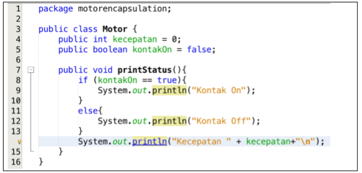

4. Kemudian buat class MotorDemo, ketikkan kode berikut ini

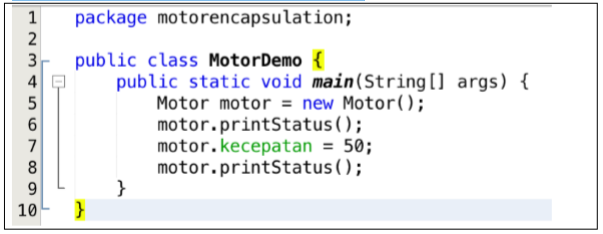

5. Hasilnya adalah sebagai berikut:

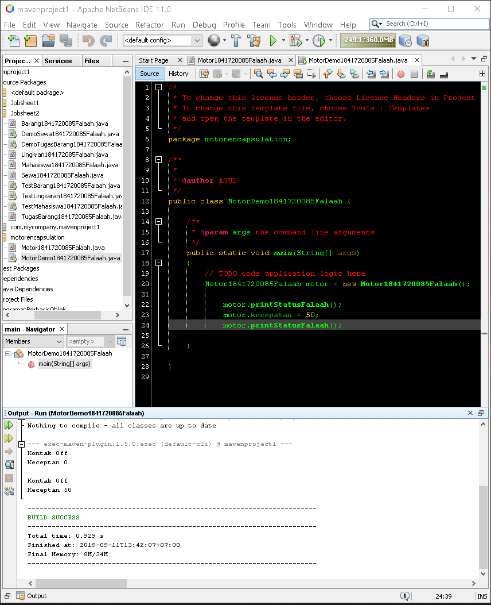

Link code class Motor : [Klik di sini](../../src/3_Enkapsulasi/Motor1841720085Falaah)

Link code class Motor Demo : [Klik di sini](../../src/3_Enkapsulasi/MotorDemo1841720085Falaah)

Dari percobaan 1 - enkapsulasi, menurut anda, adakah yang janggal?  
Yaitu, kecepatan motor tiba-tiba saja berubah dari 0 ke 50. Lebih janggal lagi, posisi kontak motor masih dalam kondisi OFF. Bagaimana mungkin sebuah motor bisa sekejap berkecepatan dari nol ke 50, dan itupun kunci kontaknya OFF?  

Nah dalam hal ini, akses ke atribut motor ternyata tidak terkontrol. Padahal, objek di dunia nyata selalu memiliki batasan dan mekanisme bagaimana objek tersebut dapat digunakan. Lalu, bagaimana kita bisa memperbaiki class Motor diatas agar dapat digunakan dengan baik? Kita bisa pertimbangkan beberapa hal berikut ini:  

1. Menyembunyikan atribut internal (kecepatan, kontakOn) dari pengguna  (class lain)  

2. Menyediakan method khusus untuk mengakses atribut.  
Untuk itu mari kita lanjutkan percobaan berikutknya tentang Access Modifier

### Percobaan 2 - Access Modifier 

Pada percobaan ini akan digunakan access modifier untuk memperbaiki cara kerja class Motor pada percobaan ke-1. 

1. Ubah cara kerja class motor sesuai dengan UML class diagram berikut. 

    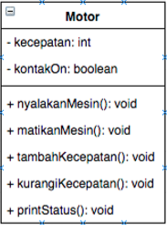

2. Berdasarkan UML class diagram tersebut maka class Motor terdapat perubahan, yaitu: 

    a. Ubah access modifier kecepatan dan kontakOn menjadi private 

    b. Tambahkan method nyalakanMesin, matikanMesin, tambahKecepatan, kurangiKecepatan. 

Implementasi class Motor adalah sebagai berikut:

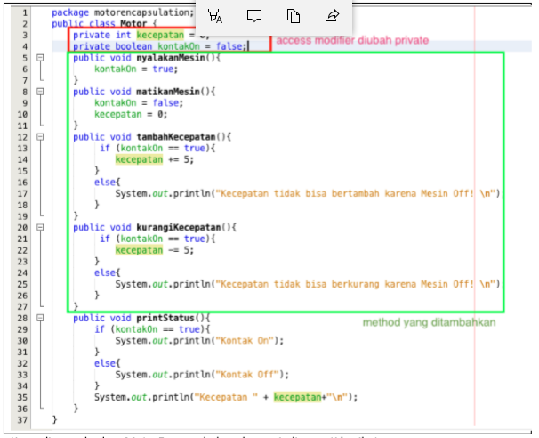

3. Kemudian pada class MotorDemo, ubah code menjadi seperti berikut:

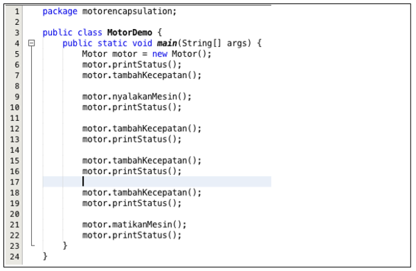

4. Hasilnya dari class MotorDemo adalah sebagai berikut: 

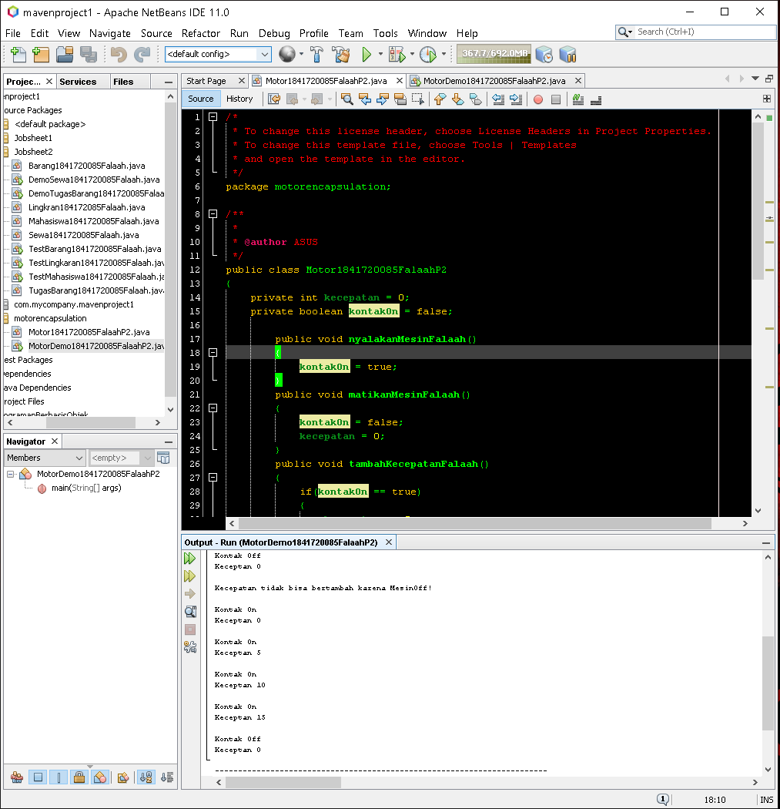

Link code class Motor : [Klik di sini](../../src/3_Enkapsulasi/Motor1841720085FalaahP2.java)

Link code class Test Motor Demo : [Kllik disini](../../src/3_Enkapsulasi/MotorDemo1841720085FalaahP2.java)

Dari percobaan diatas, dapat kita amati sekarang atribut kecepatan tidak bisa diakses oleh pengguna dan diganti nilainya secara sembarangan. Bahkan ketika mencoba menambah kecepatan saat posisi kontak masih OFF, maka akan muncul notifikasi bahwa mesin OFF. Untuk mendapatkan kecepatan 
Page 8 of 15 
 
yang diinginkan, maka harus dilakukan secara gradual, yaitu dengan memanggil method tambahKecepatan() beberapa kali. Hal ini mirip seperti saat kita mengendarai motor.  

#### Pertanyaan

1. Pada class TestMobil, saat kita menambah kecepatan untuk pertama kalinya, mengapa muncul peringatan “Kecepatan tidak bisa bertambah karena Mesin Off!”?  

2. Mengapat atribut kecepatan dan kontakOn diset private?  

3. Ubah class Motor sehingga kecepatan maksimalnya adalah 100! 

#### Jawab

1. Sebab, pada class Motor Demo saat pertama kali pemanggilan method yang belum memanggil method nyalakanMesin namun hanya memanggil method cetakStatus dan tambahKecepatan. Maka dari itu mesin masih dinyatakan Off.

2. Sebab,modifier private membuat kontakOn hanya bisa diakses oleh dari dalam class itu sendiri.

3. lakukan pemanggilan method tambahKecepatan dan cetakStatus 5 kali dan ubahlah dalam class tambahKecepatan bila kontaOn menjadi 20 (sebelumnya 5).

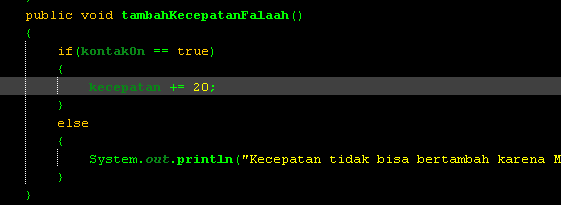

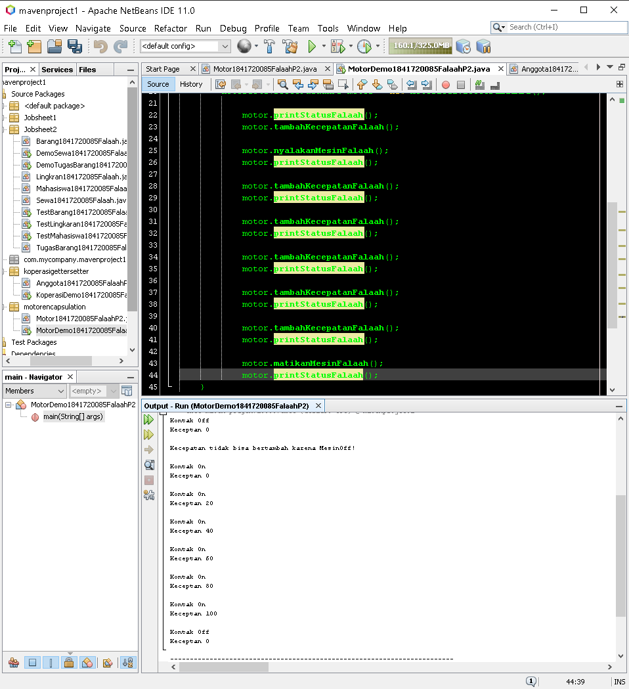

Link code class Test Motor : [Kllik disini](../../src/3_Enkapsulasi/Motor1841720085FalaahPertanyaan.java)

Link code class Test Motor Demo : [Kllik disini](../../src/3_Enkapsulasi/MotorDemo1841720085FalaahPertanyaan.java)

### Percobaan 3 - Getter dan Setter

Misalkan di sebuah sistem informasi koperasi, terdapat class Anggota. Anggota memiliki atribut nama, alamat dan simpanan, dan method setter, getter dan setor dan pinjam. Semua atribut pada anggota tidak boleh diubah sembarangan, melainkan hanya dapat diubah melalui method setter, getter, setor dan tarik. Khusus untuk atribut simpanan tidak terdapat setter karena simpanan akan bertambah ketika melakukan transaksi setor dan akan berkurang ketika melakukan peminjaman/tarik. 

1. Berikut ini UML class buatlah class Mahasiswa pada program: 

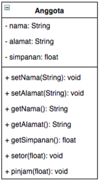

2. Sama dengan percobaan 1 untuk membuat project baru 

    a. Buka Netbeans, buat project KoperasiGetterSetter. 

    b. Buat class Anggota. Klik kanan pada package koperasigettersetter – New – Java Class. 

    c. Ketikkan kode class Anggota dibawah ini. 

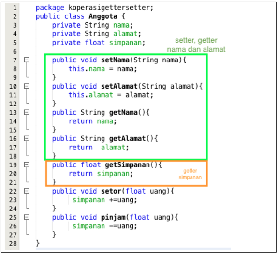

Jika diperhatikan pada class Anggota, atribut nama dan alamat memili masing-masing 1 getter dan setter. Sedangkan atribut simpanan hanya memiliki getSimpanan() saja, karena seperti tujuan awal, atribut simpanan akan berubah nilainya jika melakukan transaksi setor() dan pinjam/tarik().

3. Selanjutnya buatlah class KoperasiDemo untuk mencoba class Anggota.

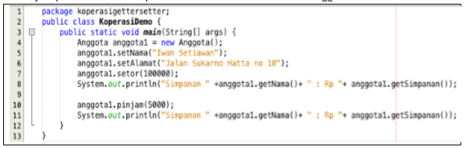

4. Hasil dari main method pada langkah ketiga adalah 

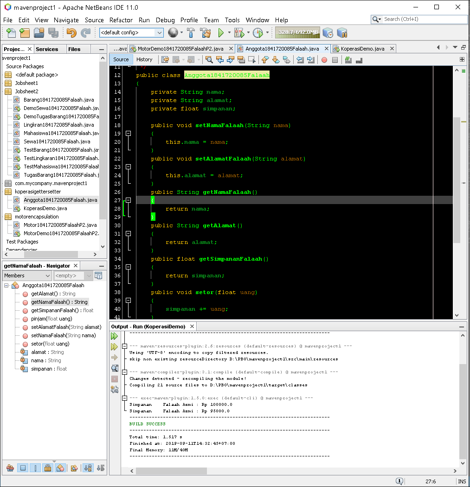

Link code class Test Anggota : [Kllik disini](../../src/3_Enkapsulasi/Anggota1841720085Falaah.java)

Link code class Test Koperasi Demo : [Kllik disini](../../src/3_Enkapsulasi/KoperasiDemo1841720085Falaah.java)

Dapat dilihat pada hasil percobaan diatas, untuk mengubah simpanan tidak dilakukan secara langsung dengan mengubah atribut simpanan, melainkan melalui method setor() dan pinjam(). Untuk menampilkan nama pun harus melalui method getNama(), dan untuk menampilkan simpanan melalui getSimpanan().  

### Percobaan 4 -  Konstruktor, Instansiasi 

1. Langkah pertama percobaan 4 adalah ubah class KoperasiDemo seperti berikut

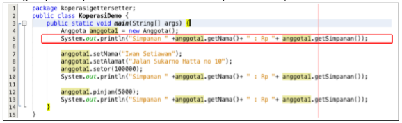

2. Hasil dari program tersebut adalah sebagai berikut 

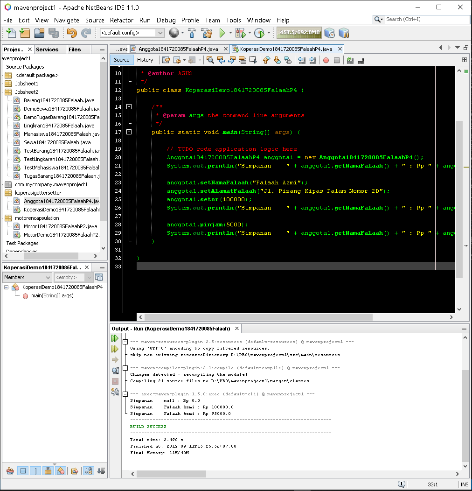

Link code class Test Anggota : [Kllik disini](../../src/3_Enkapsulasi/Anggota1841720085FalaahP4.java)

Link code class Test Koperasi : [Kllik disini](../../src/3_Enkapsulasi/KoperasiDemo1841720085FalaahP4.java)

Dapat dilihat hasil running program, ketika dilakukan pemanggilan method getNama() hasilnya hal ini terjadi  karena atribut nama belum diset nilai defaultnya. Hal ini dapat ditangani dengan membuat kontruktor. 

3. Ubah class Anggota menjadi seperti berikut 

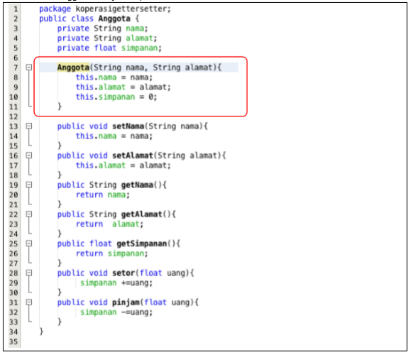

Pada class Anggota dibuat kontruktor dengan access modifier default yang memiliki 2 parameter nama dan alamat. Dan didalam konstruktor tersebut dipastikan nilai simpanan untuk pertama kali adalah Rp. 0. 

4. Selanjutnya ubah class KoperasiDemo sebagai berikut 

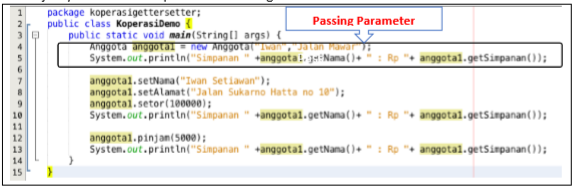

5. Hasil dari program tersebut adalah sebagai berikut

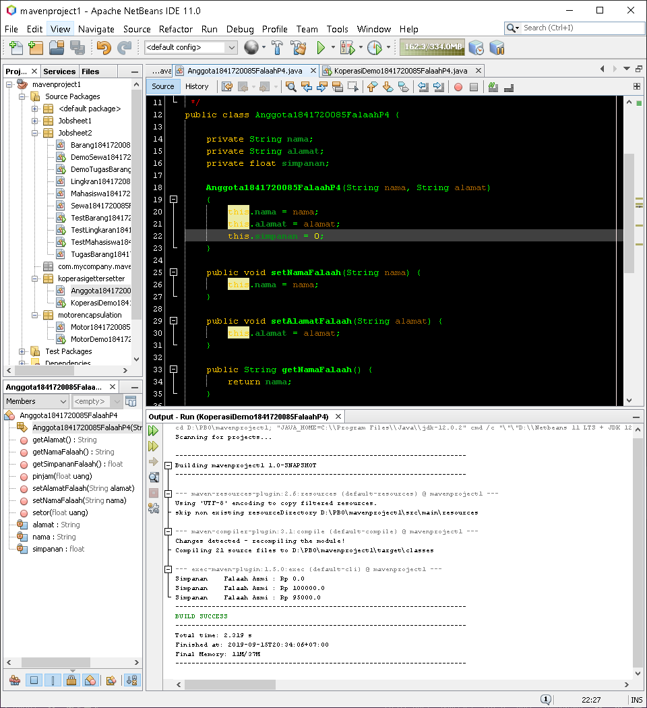

Link code class Test Anggota : [Kllik disini](../../src/3_Enkapsulasi/Anggota1841720085FalaahP5.java)

Link code class Test Koperasi : [Kllik disini](../../src/3_Enkapsulasi/KoperasiDemo1841720085FalaahP5.java)

Setelah menambah konstruktor pada class Anggoata maka atribut nama dan alamat secara otomatis harus diset terlebih dahulu dengan melakukan passing parameter jika melakukan instansiasi class Anggota. Hal ini biasa dilakukan untuk atribut yang membutuhkan nilai yang spesifik. Jika tidak membutuhkan nilai spesifik dalam konstruktor tidak perlu parameter. Contohnya simpanan untuk anggota baru diset 0, maka simpanan tidak perlu untuk dijadikan parameter pada konstruktor. 

#### Pertanyaan – Percobaan 3 dan 4 

1. Apa yang dimaksud getter dan setter?

2. Apa kegunaan dari method getSimpanan()?

3. Method apa yang digunakan untk menambah saldo? 

4. Apa yand dimaksud konstruktor? 

5. Sebutkan aturan dalam membuat konstruktor? 

6. Apakah boleh konstruktor bertipe private? 

7. Kapan menggunakan parameter dengan passsing parameter? 

8. Apa perbedaan atribut class dan instansiasi atribut? 

9. Apa perbedaan class method dan instansiasi method?

#### Jawab

1.	
- Method setter tidak memiliki nilai kembalian void (kosong). Karena tugasnya hanya untuk mengisi data ke dalam atribut.
- Method getter memiliki nilai kembalian sesuai dengan tipe data yang akan diambil.

2.	Untuk mendapatkan nilai dari atribut simpanan/

3.	Setor()/

4.	Method yang namanya sama persis dengan nama class-nya. Constructor sendiri berfungsi untuk memberikan nilai awal pada sebuah class ketika class tersebut dibuat dalam bentuk objek pada class lain.

5.	
- Suatu Constructor bisa memiliki acces modifier private
- Consturctor default akan memiliki acces modifier yang sama dengan classnya/

6.	Boleh

7.	Digunakan saat nilai default atribut pada pembuatan objek memiliki nilai tertentu.

8.	Atribute dimiliki oleh suatu class dan bersifat private, sedangkan instansiasi atribut adalah pengisian nilai awal pada atribut pada suatu objek yg baru dibuat.

9.	Class method adalah method yg berada pada suatu class yg menyatakan hal yg bisa dilakukan seperti menghitung dll, sedangkan instansiasi yaitu method yg memberi nilai awal pada suatu atribut.

## Kesimpulan

Dari semua percobaan yang sudah saya lakukan saya mengambil kesimpulan bahwa modifier private adalah modifier yang melarang method atau property yang menggunakannya di akses oleh class lain atau di luar class yang mengaksesnya. Serta modifier public adalah modifier yang jika sebuah method atau property menggunakannya bisa diakses baik diluar atau didalam class yang mengaksesnya.

Begitu juga maksud dari Enkapsulasi bahwa metode ini mengatur struktur pada class dengan bertujuan menentukan hak akses ataupun modifier yang akan digunakan pada method atau property.

Dan bagaimana kita membuat UML serta mengatikan UML tersebut hingga terbentuk menjadi sebuah code untuk dijadikan sebuah program.

## Tugas

### 1. Cobalah program dibawah ini dan tuliskan hasil outputnya

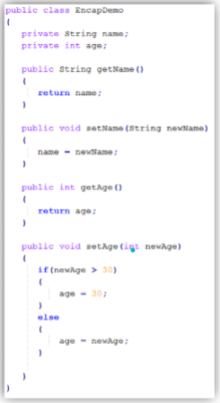  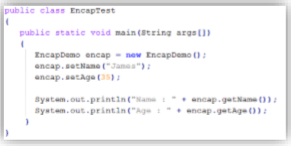

#### Jawab

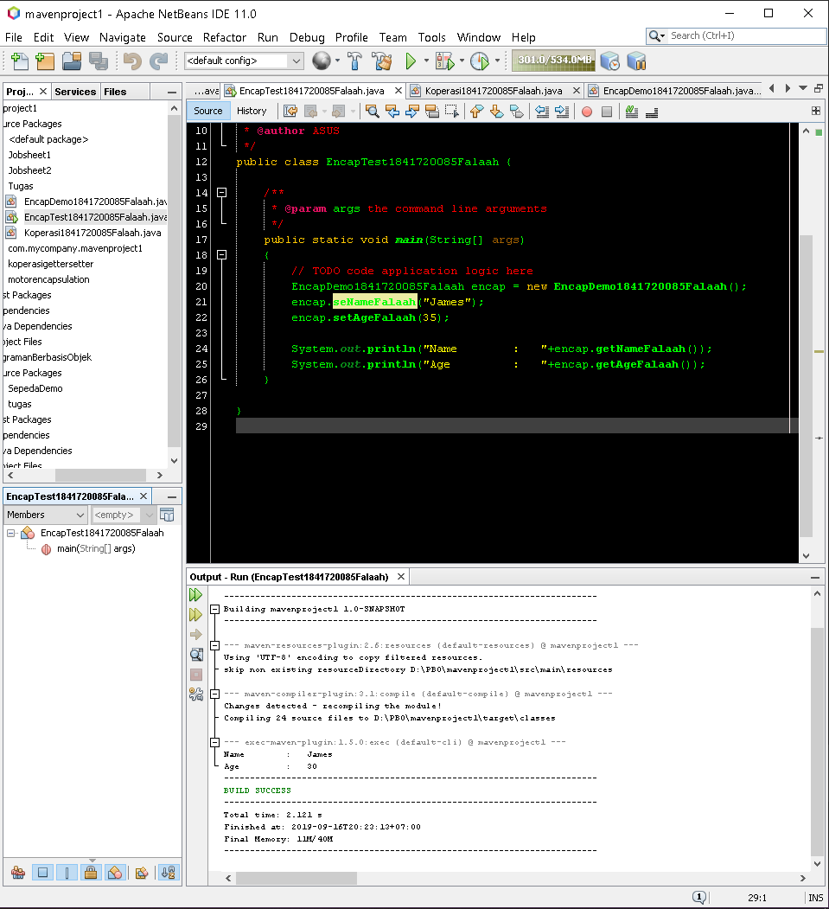

Link code class Encap Demo : [Kllik disini](../../src/3_Enkapsulasi/EncapDemo1841720085Falaah.java)

Link code class Encap Test : [Kllik disini](../../src/3_Enkapsulasi/EncapTest1841720085Falaah.java)

### 2. Pada program diatas, pada class EncapTest kita mengeset age dengan nilai 35, namun pada saat ditampilkan ke layar nilainya 30, jelaskan mengapa. 

#### Jawab

Karena, pada method setAgeFalaah bila kita menginputkan nilai/value diatas 30 maka age = 30 yang mengartikan bahwa newAge yang diatas 30 akan tercetak = 30.

### 3. Ubah program diatas agar atribut age dapat diberi nilai maksimal 30 dan minimal 18. 

#### Jawab

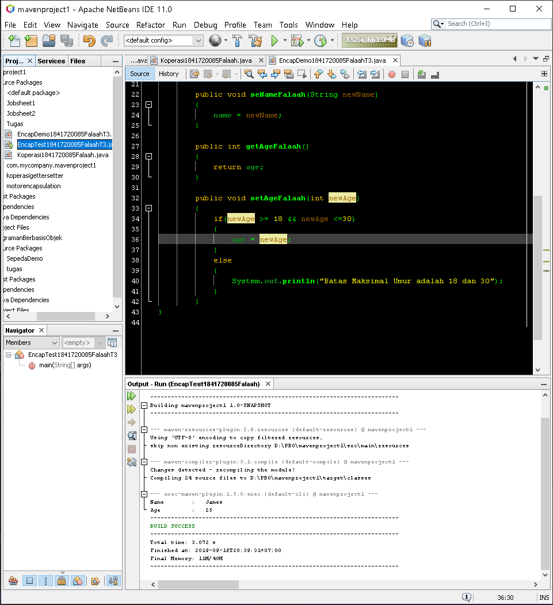

Link code class Encap Demo : [Kllik disini](../../src/3_Enkapsulasi/EncapDemo1841720085FalaahT3.java)

Link code class Encap Test : [Kllik disini](../../src/3_Enkapsulasi/EncapTest1841720085FalaahT3.java)

### 4. Pada sebuah sistem informasi koperasi simpan pinjam, terdapat class Anggota yang memiliki atribut antara lain nomor KTP, nama, limit peminjaman, dan jumlah pinjaman. Anggota dapat meminjam uang dengan batas limit peminjaman yang ditentukan. Anggota juga dapat mengangsur pinjaman. Ketika Anggota tersebut mengangsur pinjaman, maka jumlah pinjaman akan berkurang sesuai dengan nominal yang diangsur. Buatlah class Anggota tersebut, berikan atribut, method dan konstruktor sesuai dengan kebutuhan. Uji dengan TestKoperasi berikut ini untuk memeriksa apakah class Anggota yang anda buat telah sesuai dengan yang diharapkan.

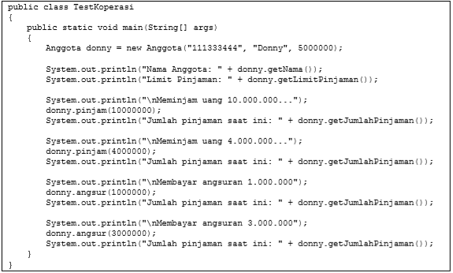

Hasil yang diharapkan: 

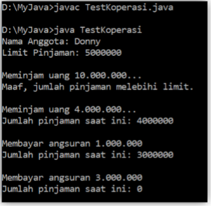

#### Jawab

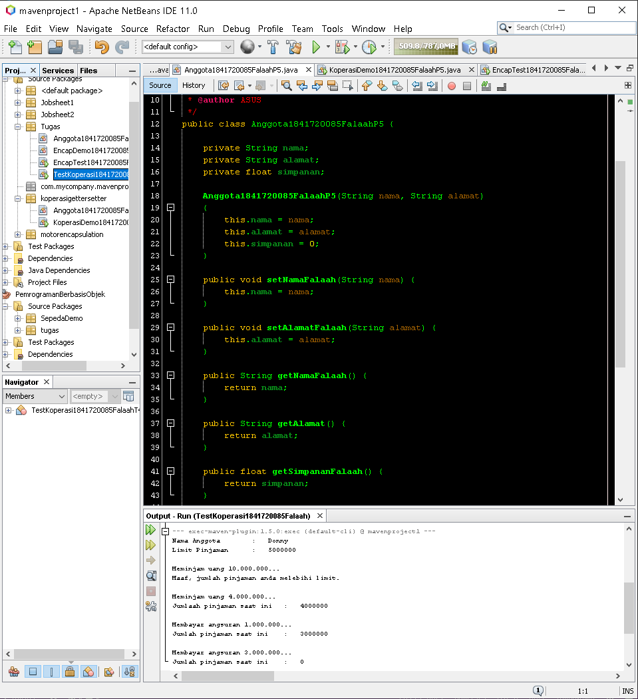

Link code class Anggota : [Kllik disini](../../src/3_Enkapsulasi/Anggota1841720085FalaahT4.java)

Link code class Test Koperasi : [Kllik disini](../../src/3_Enkapsulasi/TestKoperasi1841720085FalaahT4.java)

### 5. Modifikasi soal no. 4 agar nominal yang dapat diangsur minimal adalah 10% dari jumlah pinjaman saat ini. Jika mengangsur kurang dari itu, maka muncul peringatan “Maaf, angsuran harus 10% dari jumlah pinjaman”. 

#### Jawab

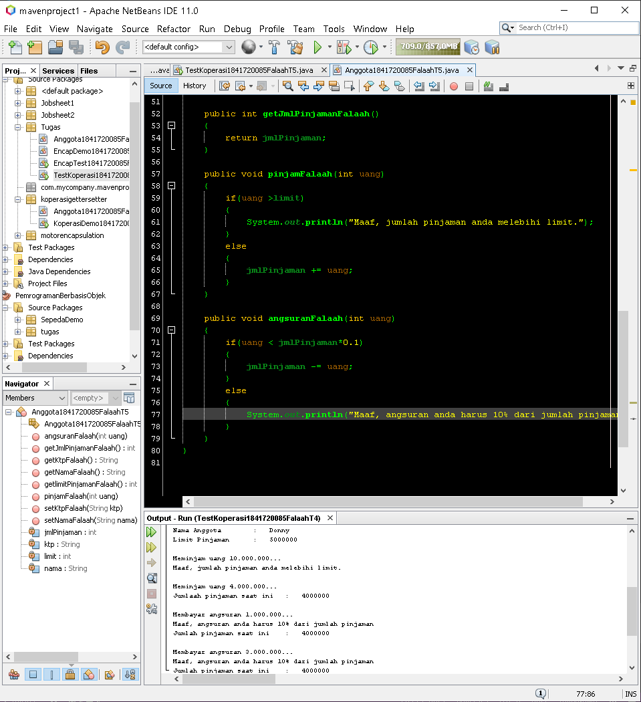

Link code class Anggota : [Kllik disini](../../src/3_Enkapsulasi/Anggota1841720085FalaahT5.java)

Link code class Test Koperasi : [Kllik disini](../../src/3_Enkapsulasi/TestKoperasi1841720085FalaahT5.java)

### 6. Modifikasi class TestKoperasi, agar jumlah pinjaman dan angsuran dapat menerima input dari console. 

#### Jawab

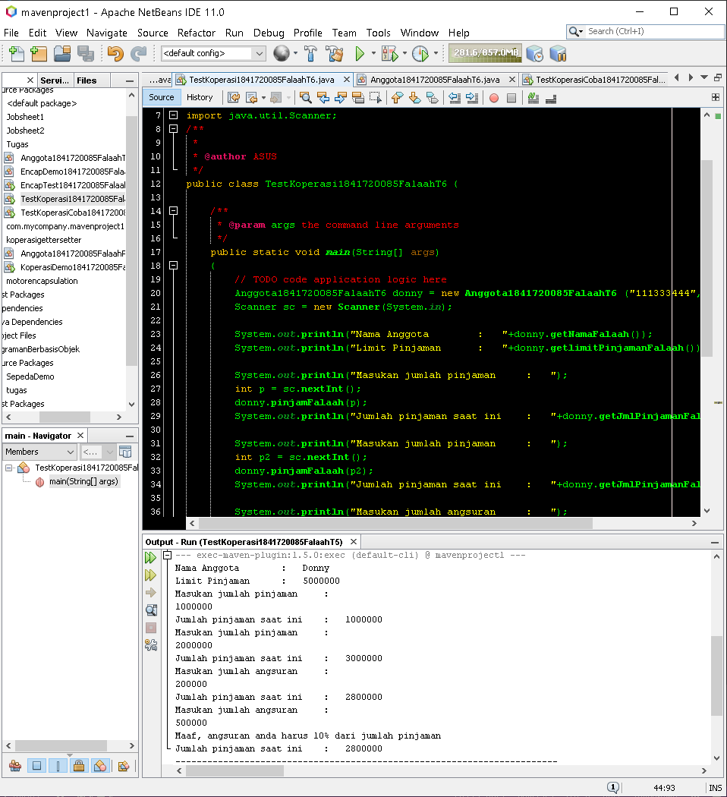

Link code class Anggota : [Kllik disini](../../src/3_Enkapsulasi/Anggota1841720085FalaahT6.java)

Link code class Test Koperasi : [Kllik disini](../../src/3_Enkapsulasi/TestKoperasi1841720085FalaahT6.java)

Ini adalah Link percobaan saya yang menggunakan switch case : [Kllik disini](../../src/3_Enkapsulasi/TestKoperasiCoba1841720085Falaah.java)

## Pernyataan Diri

Saya menyatakan isi tugas, kode program, dan laporan praktikum ini dibuat oleh saya sendiri. Saya tidak melakukan plagiasi, kecurangan, menyalin/menggandakan milik orang lain.

Jika saya melakukan plagiasi, kecurangan, atau melanggar hak kekayaan intelektual, saya siap untuk mendapat sanksi atau hukuman sesuai peraturan perundang-undangan yang berlaku.

Ttd,

(**Muhammad Falaah Azmi**)

