# Laporan Praktikum #6 - Inheritance (Pewarisan)

## Kompetensi

Setelah menempuh pokok bahasan ini, mahasiswa mampu: 
1. Memahami konsep dasar inheritance atau pewarisan.	
2. Mampu membuat suatu subclass dari suatu superclass tertentu	
3. Mampu mengimplementasikan konsep single dan multilevel inheritance.	
4. Mampu membuat objek dari suatu subclass dan melakukan pengaksesan terhadap atribut dan method baik yang dimiliki sendiri atau turunan dari superclassnya.	
  

## Ringkasan Materi

### 1. Pendahuluan

Inharitance adalah salah satu ciri utama dalam bahasa pemrograman yang berorientasi pada objek. Inti dari Inharitance yaitu bersifat reusable dengan konspe OOP dimana setiap "sub-class" akan 'mewarisi' sifat dari "super-class" selama menggunakan Akses Modifier berupa protected atau public.

Ada 2 istilah dalam inharitance yaitu "base-class/super-class/parent-class" merupakan kelas yang menurukan sifatnya dan "derived-class/sub-class/child-class" merupakan kelas yang mendapatkan turunan sifat.

Deklarasi sub-class menguunakan kata kunci "extends" yang terletak setelah deklarasi nama kelas. Kata kunci tersebut membritahu kompiler Java bahwa kita ingin melakukan pemganggilan serta perluasan class.

### Macam-macam Karakteristik (super-class)

1. Single Inheritance

Suatu class yang hanya memiliki 1 class-parent.

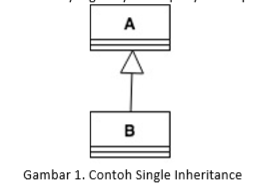

dari gambar di atas kita mengetahui bahwa "ClassB" merupakan 'subclass' yang hanya mempunya 1 'parent-class' yaitu "ClassA'.

2. Multileve Inheritance

Dimana suatu 'subc-class' menjadi 'super-clss' bagi class lain.

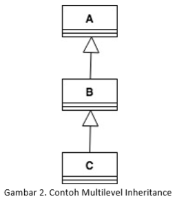

dari gambar di atas kita dapat mengamati bahawa ClassA merupakan 'super-class' bagi ClassB dimana disni merupakan 'sub-class' bagi ClassA dan ClassB merupakan 'super-class' bagi ClassC yang merupakan 'subc-class' bagi ClassB.

### Format Penulisan Kata Kunci Super

#### super.namaAtribut
Merujuk/meng-akses atribut dari parent class/superclass.

#### super.namaMethod
Merujuk/meng-akses method dari parent class/superclass.

#### super()
Merujuk/meng-akses konstruktor dari parent class/superclass.
    (hanya bisa digunakan dibaris pertama dalam konstruktor)

#### super(paramater1,dst)
Merujuk/meng-akses konstruktor berparameter dari parent class/superclass.

## Percobaan

### Percobaan 1 (extends)

1. Buatlah sebuah class parent/superclass dengan nama ClassA.java

2. Buatlah sebuah class anak/subclass dengan nama ClassB.java

3. Buatlah class Percobaan1.java untuk menjalankan program diatas!

4. Jalankan program diatas, kemudian amati apa yang terjadi!

ClassA                  : [Klik disini](../../src/6_Inheritance/Percobaan1/ClassA1841720085Falaah.java)

ClassB                  : [Klik disini](../../src/6_Inheritance/Percobaan1/ClassB1841720085Falaah.java)

Main Class Percobaan 1  : [Klik disini](../../src/6_Inheritance/Percobaan1/Percobaan1_1841720085Falaah.java)

### Pertanyaan

1. Pada	percobaan 1 diatas program yang dijalankan terjadi error, kemudian perbaiki sehingga program tersebut bisa dijalankan dan tidak error!

    Jawab:

    

    ClassA                  : [Klik disini](../../src/6_Inheritance/Pertanyaan1/ClassA1841720085Falaah.java)

    ClassB                  : [Klik disini](../../src/6_Inheritance/Pertanyaan1/ClassB1841720085Falaah.java)

    Main Class Percobaan 1  : [Klik disini](../../src/6_Inheritance/Pertanyaan1/Percobaan1_1841720085Falaah.java)

2. Jelaskan apa penyebab program pada percobaan 1 ketika dijalankan terdapat error!

    Jawab:

    Karena pada ClassB1841720085Falaah belum memiliki fungsi extends yang diarahkan ke ClasA1841720085Falaah sehingga main tidak dapat membaca variable x dan y serta method getNilaiFalaah().

### Percobaan 2 (Hak Akses)

1. Buatlah sebuah class parent/superclass dengan nama ClassA.java

2. Buatlah sebuah class anak/subclass dengan nama ClassB.java

3. Buatlah class Percobaan2.java untuk menjalankan program diatas!

4. Jalankan program diatas, kemudian amati apa yang terjadi!

Bangun                  : [Klik disini](../../src/6_Inheritance/Percobaan2/P2_ClassA1841720085Falaah.java)

Tabung                  : [Klik disini](../../src/6_Inheritance/Percobaan2/P2_ClassB1841720085Falaah.java)

Main Class Percobaan 3  : [Klik disini](../../src/6_Inheritance/Percobaan2/Percobaan2_1841720085Falaah.java)

### Pertanyaan

1. Pada percobaan 2 diatas program yang dijalankan terjadi error, kemudian perbaiki sehingga program tersebut bisa dijalankan dan tidak error!

    Jawab:

    

ClassA                  : [Klik disini](../../src/6_Inheritance/Pertanyaan2/P2_ClassA1841720085Falaah.java)

ClassB                  : [Klik disini](../../src/6_Inheritance/Pertanyaan2/P2_ClassB1841720085Falaah.java)

Main Class Percobaan 2  : [Klik disini](../../src/6_Inheritance/Pertanyaan2/Percobaan2_1841720085Falaah.java)

2. Jelaskan apa penyebab program pada percobaan 2 ketika dijalankan terdapat error!

    Jawab:

    Karena pada ClassB1841720085Falaah belum memiliki fungsi extends yang diarahkan ke ClassA1841720085Falaah dan modifier di ClassB1841720085Falaah adalah protect yang mana hanya bisa diakses di class tersebut, maka itu kita memerlukan fungsi extends untuk mengaksesnya dan melakukan perubahan acces modifier dari variable x dan y dari private menjadi protected

### Percobaan 3 (Super)

1. Buatlah sebuah class parent/superclass dengan nama Bangun.java

2. Buatlah sebuah class anak/subclass dengan nama Tabung.java

3. Buatlah class Percobaan3.java untuk menjalankan program diatas!

4. Jalankan program diatas, kemudian amati apa yang terjadi!

Bangun                  : [Klik disini](../../src/6_Inheritance/Percobaan3/Bangun1841720085Falaah.java)

Tabung                  : [Klik disini](../../src/6_Inheritance/Percobaan3/Tabung1841720085Falaah.java)

Main Class Percobaan 3  : [Klik disini](../../src/6_Inheritance/Percobaan3/Percobaan3_1841720085Falaah.java)

### Pertanyaan

1. Jelaskan fungsi “super” pada potongan program berikut di class Tabung!

      

    Jawab:

    Fungsi super pada potongan program tersebut adalah untuk memanggil atribut tersebut dari class induk/superclass.

2. Jelaskan fungsi “super” dan “this” pada potongan program berikut di class Tabung!	

      

    Jawab:

    Super sendiri menunjukkan bahwa atribut tersebut akan memanggil variable dari class induk/superclass, sedangkan pada this menunjukkan bahwa atribut tersebut akan memanggil variable dari dirinya sendiri/variable yang terdapat pada class tersebut (bukan superclass).

3. Jelaskan mengapa pada class Tabung1841720085Falaah tidak dideklarasikan atribut “phi” dan “r” tetapi class tersebut dapat mengakses atribut tersebut! 

    Jawab:

    Karena class Tabung1841720085Falaah merupakan subclass dari class Bangun1841720085Falaah sehingga atribut yang ada pada tersebut walaupun bersifat protected akan diwariskan pada subclassnya.

### Percobaan 4 (super contrustor)

1. Buatlah	tiga file dengan nama ClassA.java, ClassB.java,	dan ClassC.java, seperti pada kode program dibawah ini!	

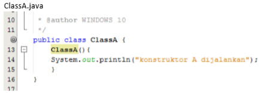

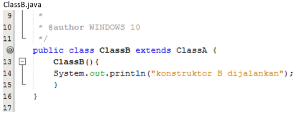

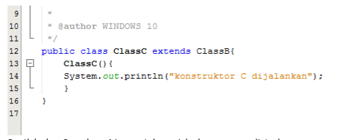

2. Buatlah class Percobaan4.java untuk menjalankan program diatas!

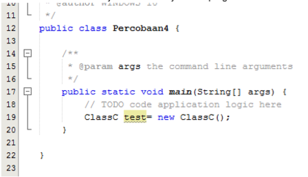

3. Jalankan program kemudian amati apa yang terjadi!

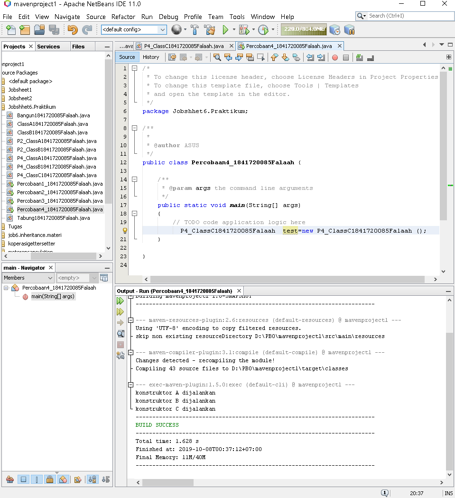

Class A                 : [Klik disini](../../src/6_Inheritance/Percobaan4/P4_ClassA1841720085Falaah.java)

Class B                 : [Klik disini](../../src/6_Inheritance/Percobaan4/P4_ClassB1841720085Falaah.java)

Class C                 : [Klik disini](../../src/6_Inheritance/Percobaan4/P4_ClassC1841720085Falaah.java)

Main Class Percobaan 4  : [Klik disini](../../src/6_Inheritance/Percobaan4/Percobaan4_1841720085Falaah.java)

### Pertanyaan

1. Pada percobaan 4 sebutkan mana class yang termasuk superclass dan subclass, kemudian jelaskan alasannya!

    Jawab:

    Superclass: EmpatA dan EmpatB 
    Subclass: EmpatB dan EmpatC 
    Karena EmpatB meng-extends class EmpatA dan di extends class EmpatC

2. Ubahlah isi konstruktor default ClassC seperti berikut:	

    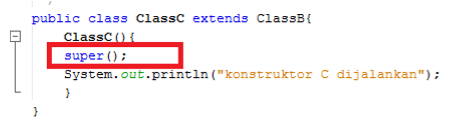  

    Tambahkan kata super() di baris	Pertaman dalam konstruktor defaultnya. Coba jalankan kembali class Percobaan4 dan terlihat tidak ada perbeda dari hasil outputnya!

    Jawab:

    

    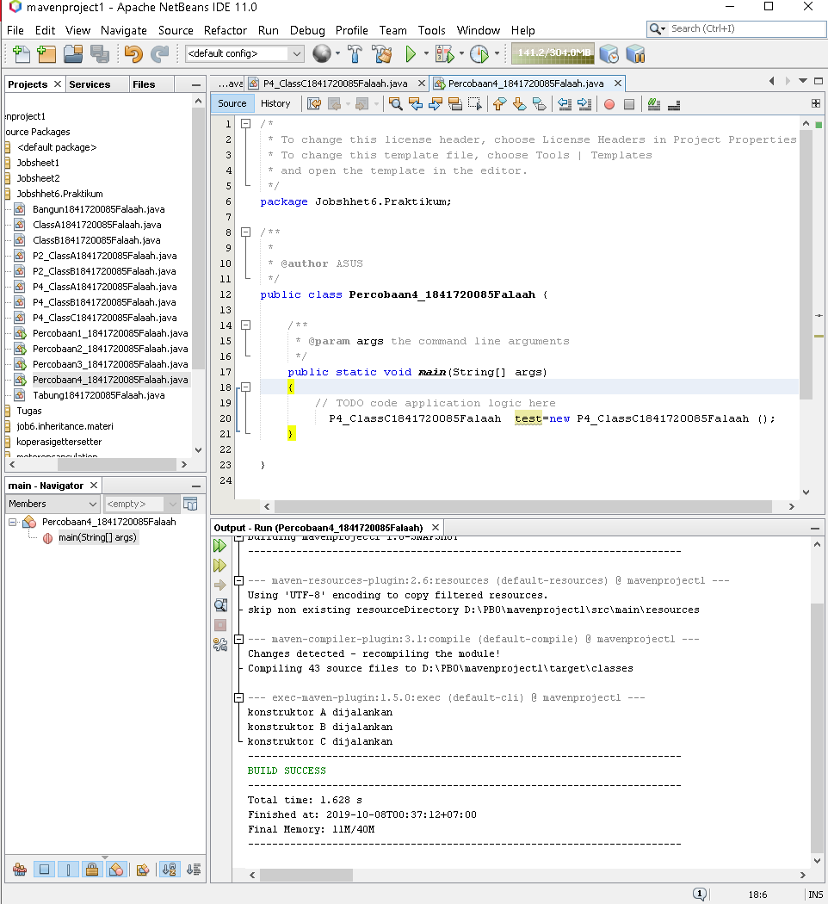

    Class C: [Klik disini](../../src/6_Inheritance/Pertanyaan4/P4_ClassC1841720085Falaah.java)

3. Ubahlah isi konstruktor default ClassC seperti berikut:	

    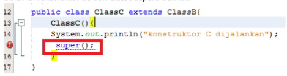  

    Ketika mengubah posisi super() dibaris kedua dalam kontruktor defaultnya dan terlihat ada error. Kemudian kembalikan super() kebaris pertama seperti sebelumnya, maka errornya akan hilang.

    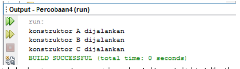  

    Jelaskan bagaimana urutan proses jalannya konstruktor saat objek test dibuat!	  

    Jawab:

    Pertama disini ClassA merupakan super Class dari ClassB yang mana ClassB menjadi subclass akan melakukan pemanggilan terhadap ClassA dengan menggunakan Funsi extends, lalu Class B menjadi superclass dikarenakan ClassC melakukan pemanggilan dengan menggunakan Fungsi extends terhadap kelasB, lalu ada fungsi super() bertujuan untuk memanggil superclass paling ujung yaitu ClassA.

4. Apakah fungsi super() pada potongan program dibawah ini di ClassC!
    
    
    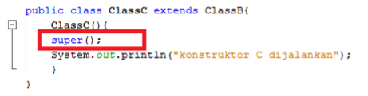  

    Jawab:

    Meujuk serta memanggil konstruktor parent class/superclass.

### Percobaan 5

Perhatikan diagram class di bawah ini:

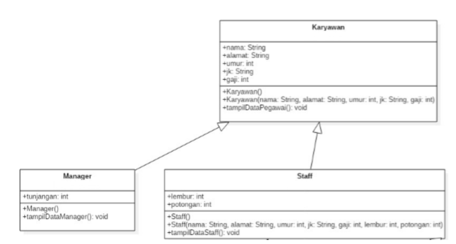

1. Buatlah class Karyawan

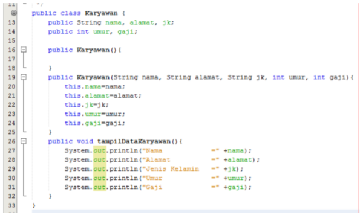

2. Buatlah class Manager

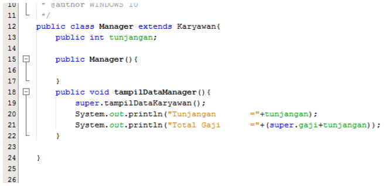

3. BUatlah class Staff

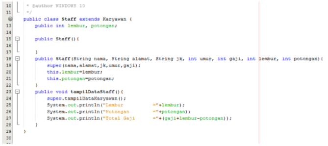

4. Buatlah class Inheritance1

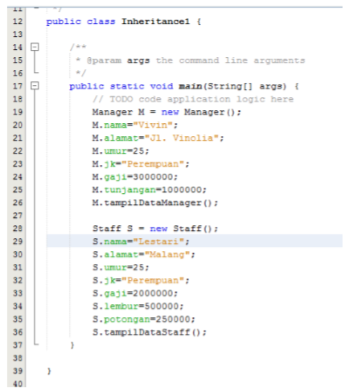

5. Jalankan program, maka tampilan adalah sebagai berikut:

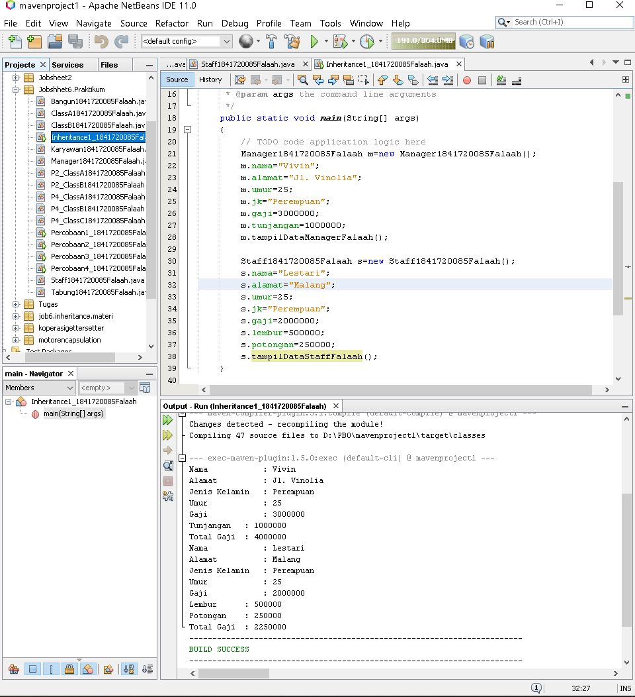

Karyawan                : [Klik disini](../../src/6_Inheritance/Percobaan5/Karyawan1841720085Falaah.java)

Manager                 : [Klik disini](../../src/6_Inheritance/Percobaan5/Manager1841720085Falaah.java)

Staff                   : [Klik disini](../../src/6_Inheritance/Percobaan5/Staff1841720085Falaah.java)

Main Class Inheritance 1  : [Klik disini](../../src/6_Inheritance/Percobaan5/Inheritance1_1841720085Falaah.java)

### Pertanyaan

1. Sebutkan class mana yang termasuk super class dan sub class dari percobaan 1 diatas!	

    Jawab:

    Super class: class Karyawan ,
    Sub class: class Manager dan class Staff.

2. Kata kunci apakah yang digunakan untuk menurunkan suatu class ke class yang lain?

    Jawab:

    'extends'

3. Perhatikan kode program pada class Manager, atribut apa saja yang dimiliki oleh class tersebut? Sebutkan atribut mana saja yang diwarisi dari class Karyawan!

    Jawab:

    Atribut dari class Manager: int tunjangan. 
    Atribut yang diwarisi dari class Karyawan: nama, alamt, jk, umur, gaji .

4. Jelaskan kata kunci super pada potongan program dibawah ini yang terdapat pada class Manager1841720085Falaah!

    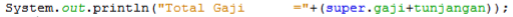

    Jawab:

    Merujuk pada super class, yaitu atribut gaji pada class Karyawan.

5. Program pada percobaan 1 diatas termasuk dalam jenis inheritance apa? Jelaskan alasannya!

    Jawab:

    Single Inheritance, karena hanya mempunyai satu parents class/superclass.

### Percobaan 6

1. Perhatikan diagram class di bawah ini:

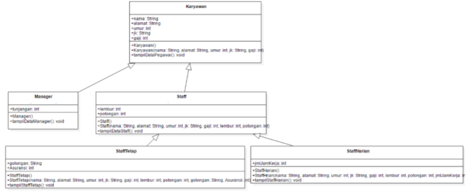

2. Berdasarkan program yang sudah anda buat pada percobaan 1 sebelumnya tambahkan dua  class yaitu class StaffTetap dan class StaffHarian. Kode Programnya adalah sebagai berikut

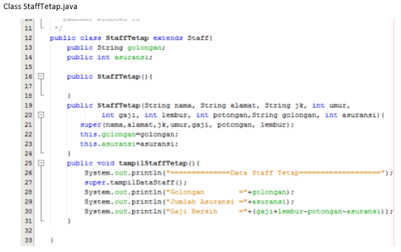

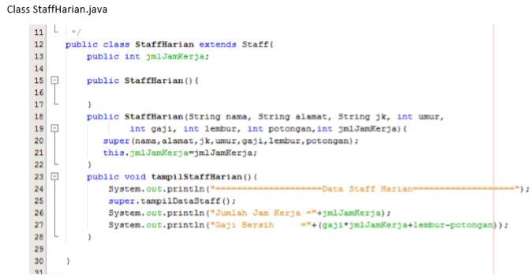

3. Setelah membuat dua class di atas kemudian edit class Inheritance1.java menjadi sebagai beriku:

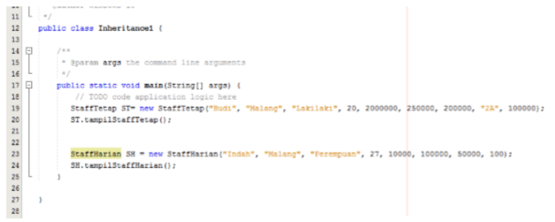
  

4. Jalankan program maka tampilannya adalah sebagai berikut:

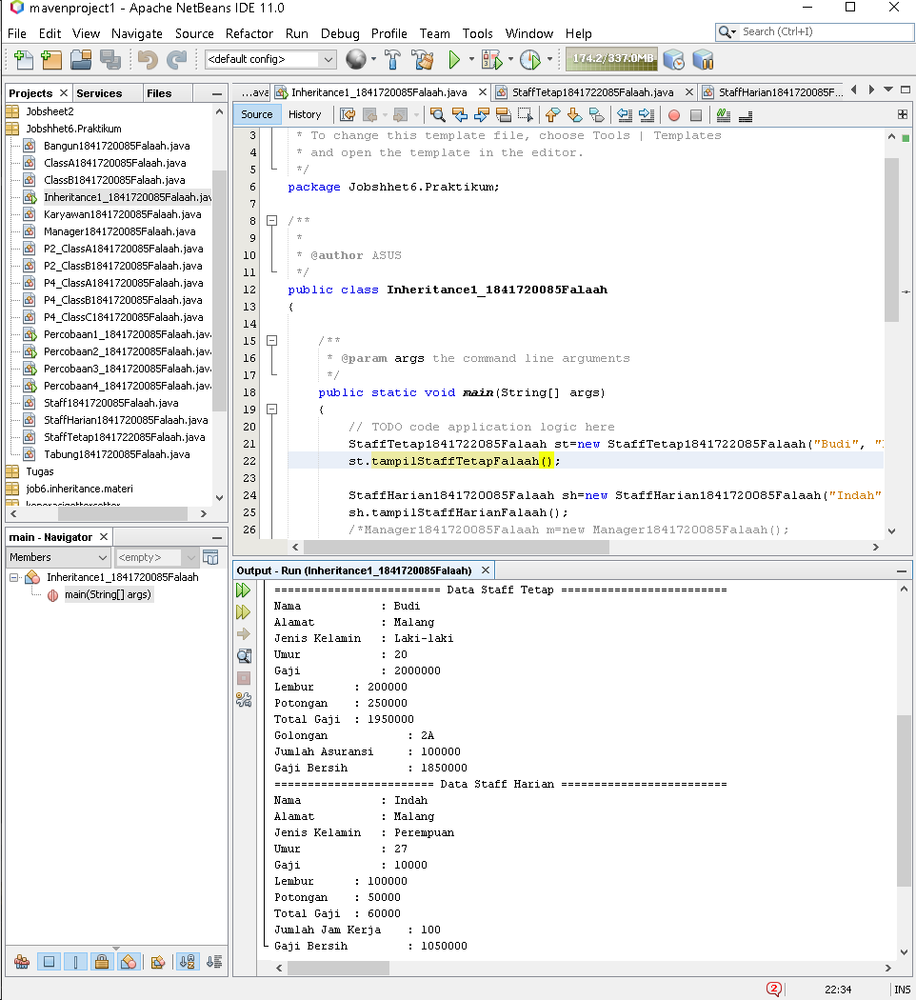

StaffTetap                  : [Klik disini](../../src/6_Inheritance/Percobaan6/StaffTetap1841722085Falaah.java)

StaffHarian                 : [Klik disini](../../src/6_Inheritance/Percobaan6/StaffHarian1841720085Falaah.java)

Main Class Inheritance 1    : [Klik disini](../../src/6_Inheritance/Percobaan6/Inheritance1_1841720085Falaah.java)

### Pertanyaan

1. Berdasarkan class diatas manakah yang termasuk single inheritance dan mana yang termasuk multilevel inheritance?

    Jawab:

    

    Kotak merah merupakan single inheritance yang mana class Manager dan Staff hanya merujuk ke 1 super class yaitu Karyawan.

    Kotak Biru merupakan multilevel inheritance yang mana Superclass beruupa class Karyawan yang dipanggil olah subclass Staff dan menjadi superclass karena dipanggil olah class StaffTetap dan StaffHarian.

2. Perhatikan kode program class StaffTetapArifin dan StaffHarianArifin, atribut apa saja yang dimiliki oleh class tersebut? Sebutkan atribut mana saja yang diwarisi dari class Staff!	
  
    Jawab:

    StaffTetap memiliki atribut golongan dan asuransi. Atribut yang diwarisi dari class Staff adalah nama,alamat,jk,umur,gaji,lembur,potongan. 
    
    StaffHarian memiliki atribut jmlJamKerja. Atribut yang diwarisi dari class Staff adalah nama, alamat, jk, umur, gaji, lembur, potongan.

3. Apakah fungsi potongan program berikut pada class StaffHarian

       

    Jawab:

    Memanggil konstruktor class yang terdapat di superclass, yaitu Staff

4. Apakah fungsi potongan program berikut pada class StaffHarian

    

    Jawab:

    Memanggil method tampil pada class Staff karena merupakan superclass.

5. Perhatikan kode program dibawah ini yang terdapat pada class	StaffTetap

    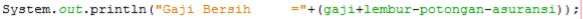

    Terlihat dipotongan program diatas atribut gaji, lembur dan potongan dapat diakses langsung. Kenapa hal ini bisa terjadi dan bagaimana class StaffTetap memiliki atribut gaji, lembur, dan potongan padahal dalam class tersebut tidak dideklarasikan atribut gaji, lembur, dan potongan?

    Jawab:

    Bisa, karena StaffTetap adalah subclass Staff yang memiliki atribut tersebut

## Tugas

1. Buatlah sebuah program dengan konsep pewarisan seperti pada class diagram berikut ini.
kemudian buatlah intansiasi untuk menampilkan class Mac, Windows, dan PC!

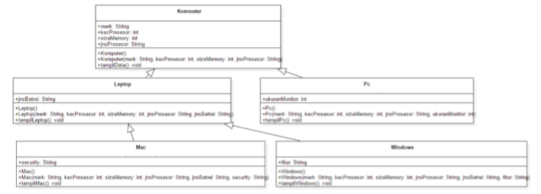

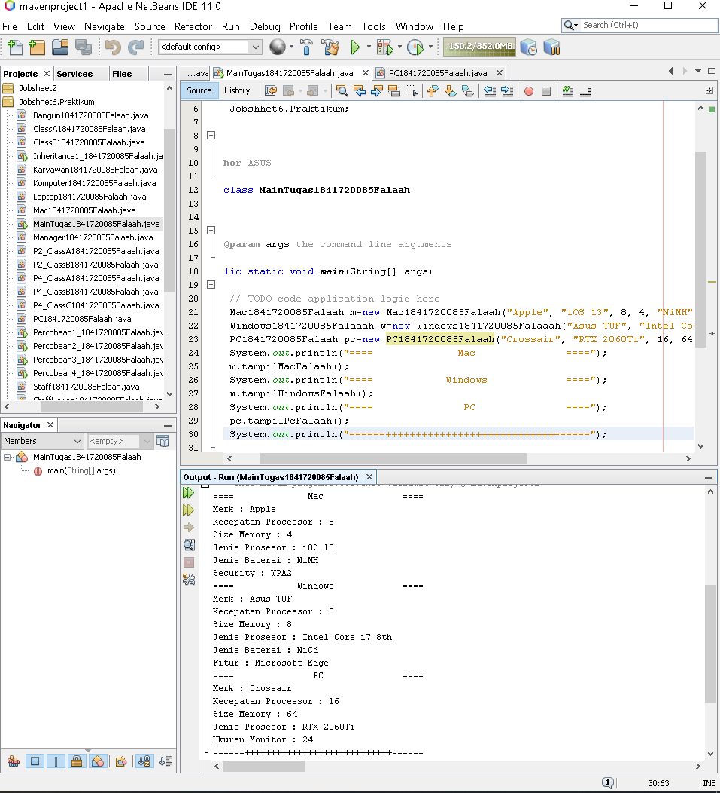

Komputer    : [Klik disini](../../src/6_Inheritance/Tugas/Komputer1841720085Falaah.java)

Laptop      : [Klik disini](../../src/6_Inheritance/Tugas/Laptop1841720085Falaah.java)

PC          : [Klik disini](../../src/6_Inheritance/Tugas/PC1841720085Falaah.java)

Mac         : [Klik disini](../../src/6_Inheritance/Tugas/Mac1841720085Falaah.java)

Windows      : [Klik disini](../../src/6_Inheritance/Tugas/Windows1841720085Falaaah.java)

Main        : [Klik disini](../../src/6_Inheritance/Tugas/MainTugas1841720085Falaah.java)

## Kesimpulan

Hal yang dapat saya simpulkan dari praktikum dan juga tugas yang telah dilakukan adalah dalam melaukakan suatu relasi kelas adalah harus diperhatikan terlebih dahulu class diagram karena class diagram yang merupakan dasar dalam pembuatan suatu program.

Kita juga dapat mengetahui bahwa Inheritance terdapat 2 macam yaitu single dan multilevel serta bagaimana ketentuan mengunakan fungsi super() dengan tepat didalam sebuah program dan bagimana cara kerja dari fungsi extends untuk melakukan penurunan sifat/pemanggilan method dll yang terdapat pada super-class yang dilakukan oleh sub-class.

## Pernyataan Diri

Saya menyatakan isi tugas, kode program, dan laporan praktikum ini dibuat oleh saya sendiri. Saya tidak melakukan plagiasi, kecurangan, menyalin/menggandakan milik orang lain.

Jika saya melakukan plagiasi, kecurangan, atau melanggar hak kekayaan intelektual, saya siap untuk mendapat sanksi atau hukuman sesuai peraturan perundang-undangan yang berlaku.

Ttd,

***(Muhammad Falaah Azmi)***