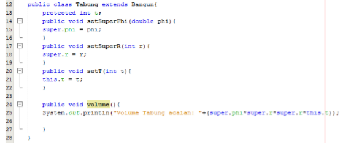

# Laporan Praktikum #6 - Inheritance (Pewarisan)

## Kompetensi

Setelah menempuh pokok bahasan ini, mahasiswa mampu: 
1. Memahami konsep dasar inheritance atau pewarisan.	
2. Mampu membuat suatu subclass dari suatu superclass tertentu	
3. Mampu mengimplementasikan konsep single dan multilevel inheritance.	
4. Mampu membuat objek dari suatu subclass dan melakukan pengaksesan terhadap atribut dan method baik yang dimiliki sendiri atau turunan dari superclassnya.	
  

## Ringkasan Materi

## Percobaan

### Percobaan 1 (extends)

1. Buatlah sebuah class parent/superclass dengan nama ClassA.java

2. Buatlah sebuah class anak/subclass dengan nama ClassB.java

3. Buatlah class Percobaan1.java untuk menjalankan program diatas!

4. Jalankan program diatas, kemudian amati apa yang terjadi!

ClassA : [Klik disini](../../src/6_Inheritance/Percobaan1/ClassA1841720085Falaah.java)

ClassB : [Klik disini](../../src/6_Inheritance/Percobaan1/ClassB1841720085Falaah.java)

Main Class Percobaan 1 : [Klik disini](../../src/6_Inheritance/Percobaan1/Percobaan1_1841720085Falaah.java)

### Pertanyaan

1. Pada	percobaan 1 diatas program yang dijalankan terjadi error, kemudian perbaiki sehingga program tersebut bisa dijalankan dan tidak error!

    Jawab:

    

    ClassA : [Klik disini](../../src/6_Inheritance/Pertanyaan1/ClassA1841720085Falaah.java)

    ClassB : [Klik disini](../../src/6_Inheritance/Pertanyaan1/ClassB1841720085Falaah.java)

    Main Class Percobaan 1 : [Klik disini](../../src/6_Inheritance/Pertanyaan1/Percobaan1_1841720085Falaah.java)

2. Jelaskan apa penyebab program pada percobaan 1 ketika dijalankan terdapat error!

    Jawab:

    Karena pada ClassB1841720085Falaah belum memiliki fungsi extends yang diarahkan ke ClasA1841720085Falaah sehingga main tidak dapat membaca variable x dan y serta method getNilaiFalaah().

### Percobaan 2 (Hak Akses)

1. Buatlah sebuah class parent/superclass dengan nama ClassA.java

2. Buatlah sebuah class anak/subclass dengan nama ClassB.java

3. Buatlah class Percobaan2.java untuk menjalankan program diatas!

4. Jalankan program diatas, kemudian amati apa yang terjadi!

Bangun : [Klik disini](../../src/6_Inheritance/Percobaan2/P2_ClassA1841720085Falaah.java)

Tabung : [Klik disini](../../src/6_Inheritance/Percobaan2/P2_ClassB1841720085Falaah.java)

Main Class Percobaan 3 : [Klik disini](../../src/6_Inheritance/Percobaan2/Percobaan2_1841720085Falaah.java)

### Pertanyaan

1. Pada percobaan 2 diatas program yang dijalankan terjadi error, kemudian perbaiki sehingga program tersebut bisa dijalankan dan tidak error!

    Jawab:

    

ClassA : [Klik disini](../../src/6_Inheritance/Pertanyaan2/P2_ClassA1841720085Falaah.java)

ClassB : [Klik disini](../../src/6_Inheritance/Pertanyaan2/P2_ClassB1841720085Falaah.java)

Main Class Percobaan 2 : [Klik disini](../../src/6_Inheritance/Pertanyaan2/Percobaan2_1841720085Falaah.java)

2. Jelaskan apa penyebab program pada percobaan 2 ketika dijalankan terdapat error!

    Jawab:

    Karena pada ClassB1841720085Falaah belum memiliki fungsi extends yang diarahkan ke ClassA1841720085Falaah dan modifier di ClassB1841720085Falaah adalah protect yang mana hanya bisa diakses di class tersebut, maka itu kita memerlukan fungsi extends untuk mengaksesnya dan melakukan perubahan acces modifier dari variable x dan y dari private menjadi protected

### Percobaan 3 (Super)

1. Buatlah sebuah class parent/superclass dengan nama Bangun.java

2. Buatlah sebuah class anak/subclass dengan nama Tabung.java

3. Buatlah class Percobaan3.java untuk menjalankan program diatas!

4. Jalankan program diatas, kemudian amati apa yang terjadi!

Bangun : [Klik disini](../../src/6_Inheritance/Percobaan3/Bangun1841720085Falaah.java)

Tabung : [Klik disini](../../src/6_Inheritance/Percobaan3/Tabung1841720085Falaah.java)

Main Class Percobaan 3 : [Klik disini](../../src/6_Inheritance/Percobaan3/Percobaan3_1841720085Falaah.java)

### Pertanyaan

1. Jelaskan fungsi “super” pada potongan program berikut di class Tabung!

      

    Jawab:

    Fungsi super pada potongan program tersebut adalah untuk memanggil atribut tersebut dari class induk/superclass.

2. Jelaskan fungsi “super” dan “this” pada potongan program berikut di class Tabung!	

      

    Jawab:

    Super sendiri menunjukkan bahwa atribut tersebut akan memanggil variable dari class induk/superclass, sedangkan pada this menunjukkan bahwa atribut tersebut akan memanggil variable dari dirinya sendiri/variable yang terdapat pada class tersebut (bukan superclass).

3. Jelaskan mengapa pada class Tabung1841720085Falaah tidak dideklarasikan atribut “phi” dan “r” tetapi class tersebut dapat mengakses atribut tersebut! 

    Jawab:

    Karena class Tabung1841720085Falaah merupakan subclass dari class Bangun1841720085Falaah sehingga atribut yang ada pada tersebut walaupun bersifat protected akan diwariskan pada subclassnya.

### Percobaan 4

Contoh kode program pada class ClassA1841720085Falaah.java : [ini link ke kode program](../../src/6_Inheritance/Percobaan_4/ClassA1841720085Falaah.java)

Contoh kode program pada class ClassB1841720085Falaah.java : [ini link ke kode program](../../src/6_Inheritance/Percobaan_4/ClassB1841720085Falaah.java)

Contoh kode program pada class ClassC1841720085Falaah.java : [ini link ke kode program](../../src/6_Inheritance/Percobaan_4/ClassC1841720085Falaah.java)

Contoh kode program pada main class Percobaan41841720085Falaah.java : [ini link ke kode program](../../src/6_Inheritance/Percobaan_4/Percobaan41841720085Falaah.java)

### Pertanyaan

1. Pada percobaan 4 sebutkan mana class yang termasuk superclass dan subclass, kemudian jelaskan alasannya!

    Jawab:

    Yang merupakan Superclass adalah ClassA1841720085Falaah dan subclassnya adalah ClassB1841720085Falaah kenapa bisa begitu ?, karena ClassA1841720085Falaah merupakan class induk yang tidak diwarisi oleh class lain namun mewarikan pada class lain sedangkan pada ClassB1841720085Falaah merupakan subclass karena diwariskan dari ClassA1841720085Falaah namun bisa dikatakan sebagai superclass juga karena mewariskan pada ClassC1841720085Falaah.

2. Ubahlah isi konstruktor default ClassC seperti berikut:	

      

    Tambahkan kata super() di baris	Pertaman dalam konstruktor defaultnya. Coba jalankan kembali class Percobaan4 dan terlihat tidak ada perbeda dari hasil outputnya!

    Jawab:

    

    

3. Ubahlah isi konstruktor default ClassC seperti berikut:	

      

    Ketika mengubah posisi super() dibaris kedua dalam kontruktor defaultnya dan terlihat ada error. Kemudian kembalikan super() kebaris pertama seperti sebelumnya, maka errornya akan hilang.

      

    Jelaskan bagaimana urutan proses jalannya konstruktor saat objek test dibuat!	  

    Jawab:

    sadsad

4. Apakah fungsi super() pada potongan program dibawah ini di ClassC!
    
    
      

    Jawab:

    asdasdsad

### Percobaan 5

Contoh kode program pada class Karyawan1841720085Falaah.java : [ini link ke kode program](../../src/6_Inheritance/Percobaan_5/Karyawan1841720085Falaah.java)

Contoh kode program pada class Manager1841720085Falaah.java : [ini link ke kode program](../../src/6_Inheritance/Percobaan_5/Manager1841720085Falaah.java)

Contoh kode program pada class Staff1841720085Falaah.java : [ini link ke kode program](../../src/6_Inheritance/Percobaan_5/Staff1841720085Falaah.java)

Contoh kode program pada main class Inheritance11841720085Falaah.java : [ini link ke kode program](../../src/6_Inheritance/Percobaan_5/Inheritance11841720085Falaah.java)

### Pertanyaan

1. Sebutkan class mana yang termasuk super class dan sub class dari percobaan 1 diatas!	

    Jawab:

2. Kata kunci apakah yang digunakan untuk menurunkan suatu class ke class yang lain?

    Jawab:

3. Perhatikan kode program pada class Manager, atribut apa saja yang dimiliki oleh class tersebut? Sebutkan atribut mana saja yang diwarisi dari class Karyawan!

    Jawab:

4. Jelaskan kata kunci super pada potongan program dibawah ini yang terdapat pada class Manager1841720085Falaah!

    

    Jawab:

5. Program pada percobaan 1 diatas termasuk dalam jenis inheritance apa? Jelaskan alasannya!

    Jawab:

### Percobaan 6

Contoh kode program pada class ClassA1841720085Falaah.java : [ini link ke kode program](../../src/6_Inheritance/Percobaan_6/ClassA1841720085Falaah.java)

Contoh kode program pada class ClassB1841720085Falaah.java : [ini link ke kode program](../../src/6_Inheritance/Percobaan_6/ClassB1841720085Falaah.java)

Contoh kode program pada class ClassC1841720085Falaah.java : [ini link ke kode program](../../src/6_Inheritance/Percobaan_6/ClassC1841720085Falaah.java)

Contoh kode program pada main class Percobaan41841720085Falaah.java : [ini link ke kode program](../../src/6_Inheritance/Percobaan_6/Percobaan41841720085Falaah.java)

### Pertanyaan

1. Berdasarkan class diatas manakah yang termasuk single inheritance dan mana yang termasuk multilevel inheritance?

    Jawab:

    

2. Perhatikan kode program class StaffTetapArifin dan StaffHarianArifin, atribut apa saja yang dimiliki oleh class tersebut? Sebutkan atribut mana saja yang diwarisi dari class Staff!	
  
    Jawab:

3. Apakah fungsi potongan program berikut pada class StaffHarian

       

    Jawab:

4. Apakah fungsi potongan program berikut pada class StaffHarian

    

    Jawab:

5. Perhatikan kode program dibawah ini yang terdapat pada class	StaffTetap

    

    Terlihat dipotongan program diatas atribut gaji, lembur dan potongan dapat diakses langsung. Kenapa hal ini bisa terjadi dan bagaimana class StaffTetap memiliki atribut gaji, lembur, dan potongan padahal dalam class tersebut tidak dideklarasikan atribut gaji, lembur, dan potongan?

    Jawab:

## Tugas

Contoh link kode program pada class Kursi1841720085Falaah.java : [ini contoh link ke kode program](../../src/4_Relasi_Class/Tugas/Kursi1841720085Falaah.java)

Contoh link kode program pada class Pegawai1841720085Falaah.java : [ini contoh link ke kode program](../../src/4_Relasi_Class/Tugas/Pegawai1841720085Falaah.java)

Contoh link kode program pada class Penumpang1841720085Falaah.java : [ini contoh link ke kode program](../../src/4_Relasi_Class/Tugas/Penumpang1841720085Falaah.java)

Contoh link kode program pada class Pesawat1841720085Falaah.java : [ini contoh link ke kode program](../../src/4_Relasi_Class/Tugas/Pesawat1841720085Falaah.java)

Contoh link kode program pada class main MainTugas.java : [ini contoh link ke kode program](../../src/4_Relasi_Class/Tugas/MainTugas.java)

## Kesimpulan

Hal yang dapat saya simpulkan dari praktikum dan juga tugas yang telah dilakukan adalah dalam melaukakan suatu relasi kelas adalah harus diperhatikan terlebih dahulu class diagram karena class diagram yang merupakan dasar dalam pembuatan suatu program.

## Pernyataan Diri

Saya menyatakan isi tugas, kode program, dan laporan praktikum ini dibuat oleh saya sendiri. Saya tidak melakukan plagiasi, kecurangan, menyalin/menggandakan milik orang lain.

Jika saya melakukan plagiasi, kecurangan, atau melanggar hak kekayaan intelektual, saya siap untuk mendapat sanksi atau hukuman sesuai peraturan perundang-undangan yang berlaku.

Ttd,

***(Muhammad Falaah Azmi)***