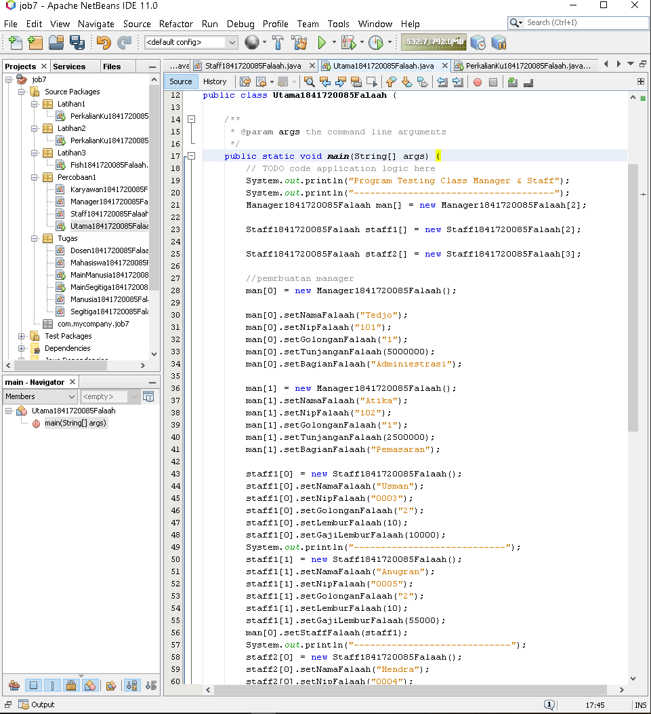

# Laporan Praktikum #7 - Overloading dan Overriding

## 1.Kompetensi

1. Memahami konsep Overloading dan Overriding.
2. Memahami perbedaan Overloading dan Overriding.
3. Ketetapatan dalam mengidentifikasi method overloading dan overriding
4. Mengimplementasi method overloading dan overriding.

## 2.Ringkasan Materi
### 2.1 Overloading
adalah menuliskan kembali method dengan nama yang sama pada suatu class. Tujuannya dapat memudahkan penggunaan/pemanggilan method dengan fungsionalitas yang mirip.

Aturan : 
1. Nama method harus sama
2. Parameter berbeda
3. Jika tipe return boleh sama.

### 2.2 Overriding
adalah Sublass yang berusaha memodifkasi tingkah laku yang diwarisi dari superclass. Tujuannya subclass dapat memiliki tingkah laku yang lebih spesifik sehingga dapat dilakukan dengan cara mendeklarasikan kembali method milik parent class di subclass.

Dimana harus memiliki kesamaan dari subclass terhadap super class :
1. Nama
2. Return type
3. Parameter

## 3.Praktikum
### 3.1 Percobaan 1

Untuk kasus contoh berikut terdapat tigas class, yaitu karyawan, manager, dan staff. class karyawan merupakan cuperclass dari manager dan staff dimana subclass manager dan staff memiliki method untuk menghitung gaji yang berbeda.

Tuliskan kode program berikut :

### 3.2 Karyawan

### 3.3 Staff

### 3.4 Manager

### 3.5 Utama

Di Netbean :

Output :

link Class Karyawan : 
[Klik Disini](../../src/7_Overriding_dan_Overloading/percobaan/Karyawan1841720085Falaah.java)

link Class Staff : 
[Klik Disini](../../src/7_Overriding_dan_Overloading/percobaan/Staff1841720085Falaah.java)

link Class Manager : 
[Klik Disini](../../src/7_Overriding_dan_Overloading/percobaan/Manager1841720085Falaah.java)

link Class Utama : 
[Klik Disini](../../src/7_Overriding_dan_Overloading/percobaan/Utama1841720085Falaah.java)

## 4. Latihan 
## - Overloading -
### Soal 1

link Class PerkalianKu : 
[Klik Disini](../../src/7_Overriding_dan_Overloading/latihan1/PerkalianKu1841720085Falaah.java)

4.1 Dari source coding diatas terletak dimanakah overloading ?
> jawab : 

4.2 Jika terdapat overloading ada berapa jumlah parameter yag berbeda.
> jawab : ada 1 parameter yang berbeda yaitu int c.

#### Soal 2

link Class PerkalianKu : 
[Klik Disini](../../src/7_Overriding_dan_Overloading/latihan2/PerkalianKu1841720085Falaah.java)

4.3 Dari source coding diatas terletak dimanakah overloading?
> jawab : 

4.4 Jika terdapat overloading ada berapa tipe parameter yang berbeda ?
> jawab : terdapat 4 parameter berbeda yaitu int a, int b, doublr a, double b.

## - Overriding -
### Soal 1

4.5 Dari source coding diatas terletak dimanakah overriding ? 
> jawab : 

4.6 Jabarkan apabila sourcoding diatas jika terdapat overriding? 
> jawab : Deklarasi method pada subclass Piranha1841720085Falaah sama dengan method superclass Ikan1841720085Falaah

## Tugas

### 5.1 Overloading

Implementasikan konsep overloading pada class diagram dibawah ini :

Jawab :

link Class Segitiga : 
[Klik Disini](../../src/7_Overriding_dan_Overloading/tugas/overloading/Segitiga1841720085Falaah.java)

link Class Main Segitiga : 
[Klik Disini](../../src/7_Overriding_dan_Overloading/tugas/overloading/MainSegitiga1841720085Falaah.java)

### Overriding

Implementasikan class diagram dibawah ini dengan menggunakan teknik dynamic method dispatch :

Jawab :

linkClass Manusia : 
[Klik Disini](../../src/7_Overriding_dan_Overloading/tugas/overriding/Manusia1841720085Falaah.java)

link Class Dosen : 
[Klik Disini](../../src/7_Overriding_dan_Overloading/tugas/overriding/Dosen1841720085Falaah.java)

link Class Mahasiswa : 
[Klik Disini](../../src/7_Overriding_dan_Overloading/tugas/overriding/Mahasiswa1841720085Falaah.java)

link Class Main : 
[Klik Disini](../../src/7_Overriding_dan_Overloading/tugas/overriding/MainManusia1841720085Falaah.java)

## Kesimpulan

Dari semua praktikum, latihan, dan tugas yang sudah saya lakukan dapat disimpulkan bahwa Overloading harus memiliki perbedaan tipe data, konstruktor default atau berparameter, dan jumlah dari variable di tiap class yang ingin melakukan Overloading serta Overriding dimana pendeklarasian method di parent dan child sama dan class child hanya dapat melakukan overriding sebanyak satu kali terhadap class parent.

## Pernyataan Diri

Saya menyatakan isi tugas, kode program, dan laporan praktikum ini dibuat oleh saya sendiri. Saya tidak melakukan plagiasi, kecurangan, menyalin/menggandakan milik orang lain.

Jika saya melakukan plagiasi, kecurangan, atau melanggar hak kekayaan intelektual, saya siap untuk mendapat sanksi atau hukuman sesuai peraturan perundang-undangan yang berlaku.

Ttd,

***(Muhammad Falaah Azmi)***
