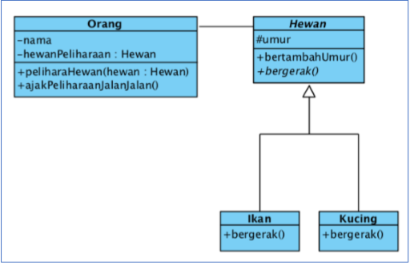
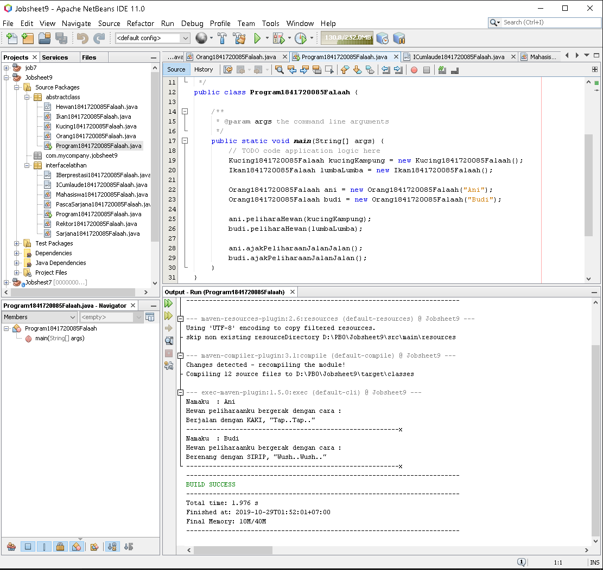
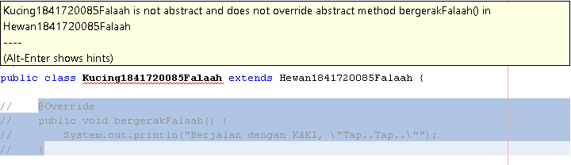
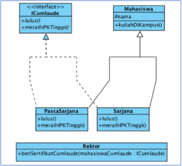
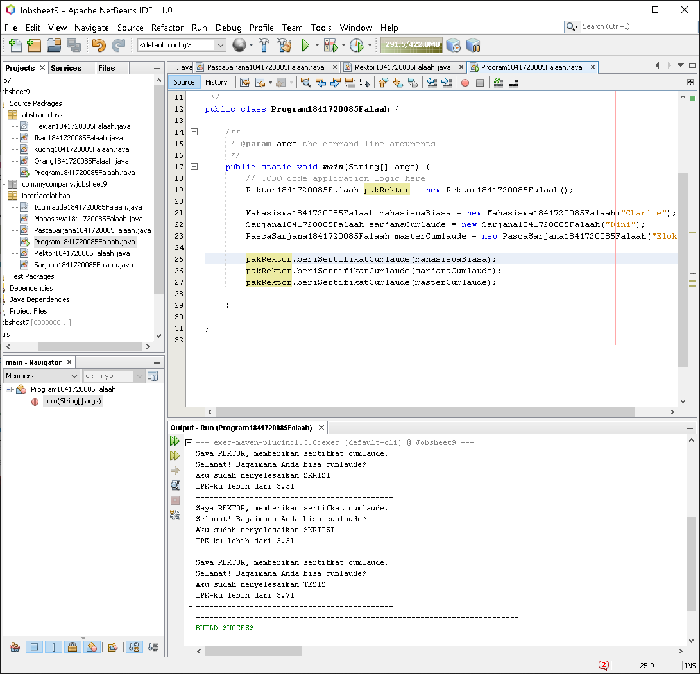
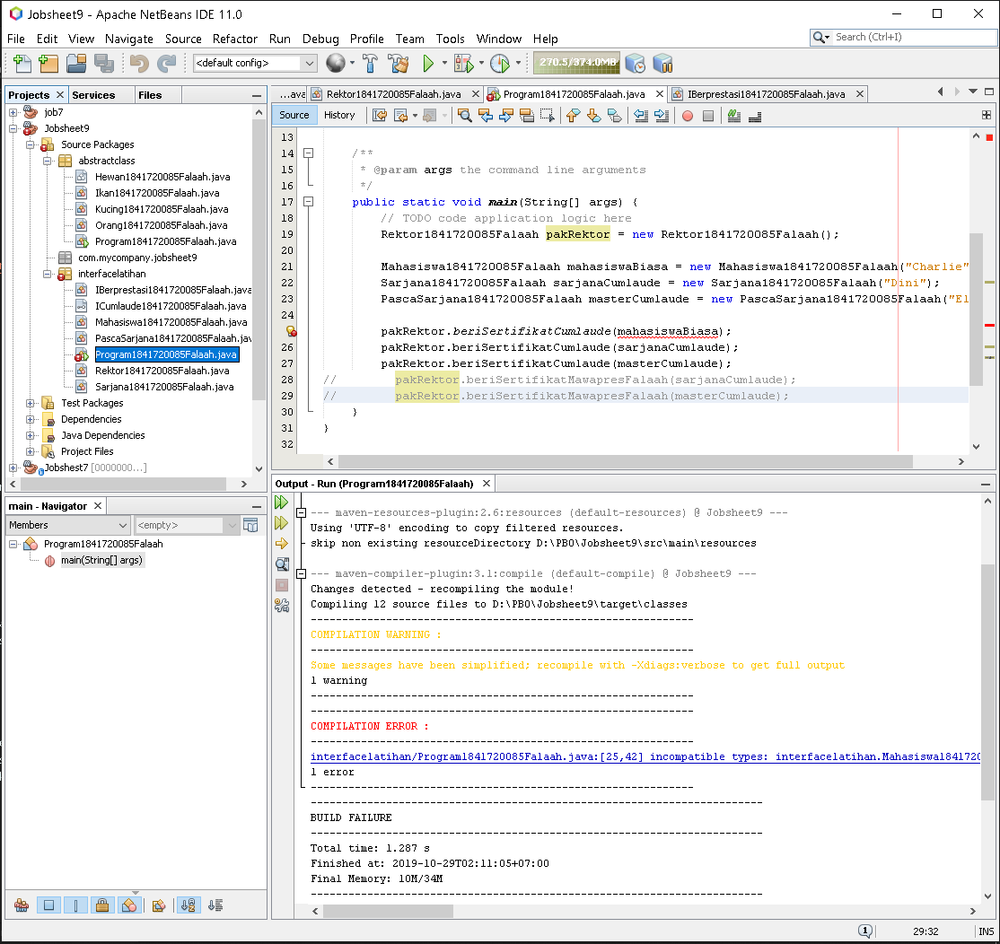
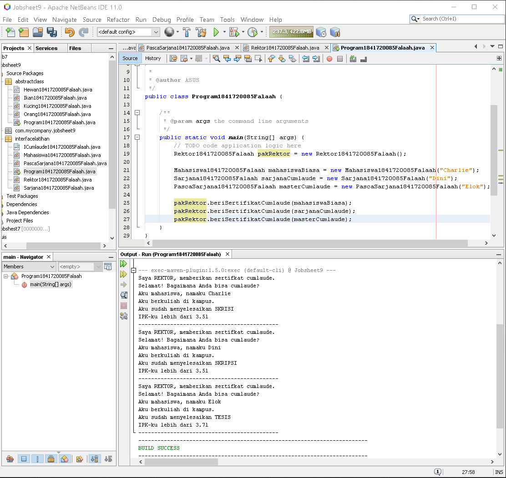
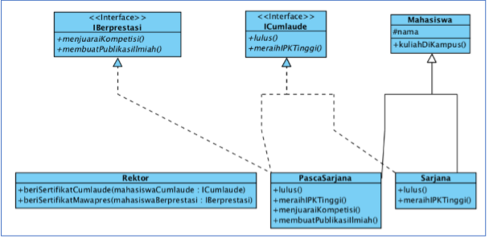
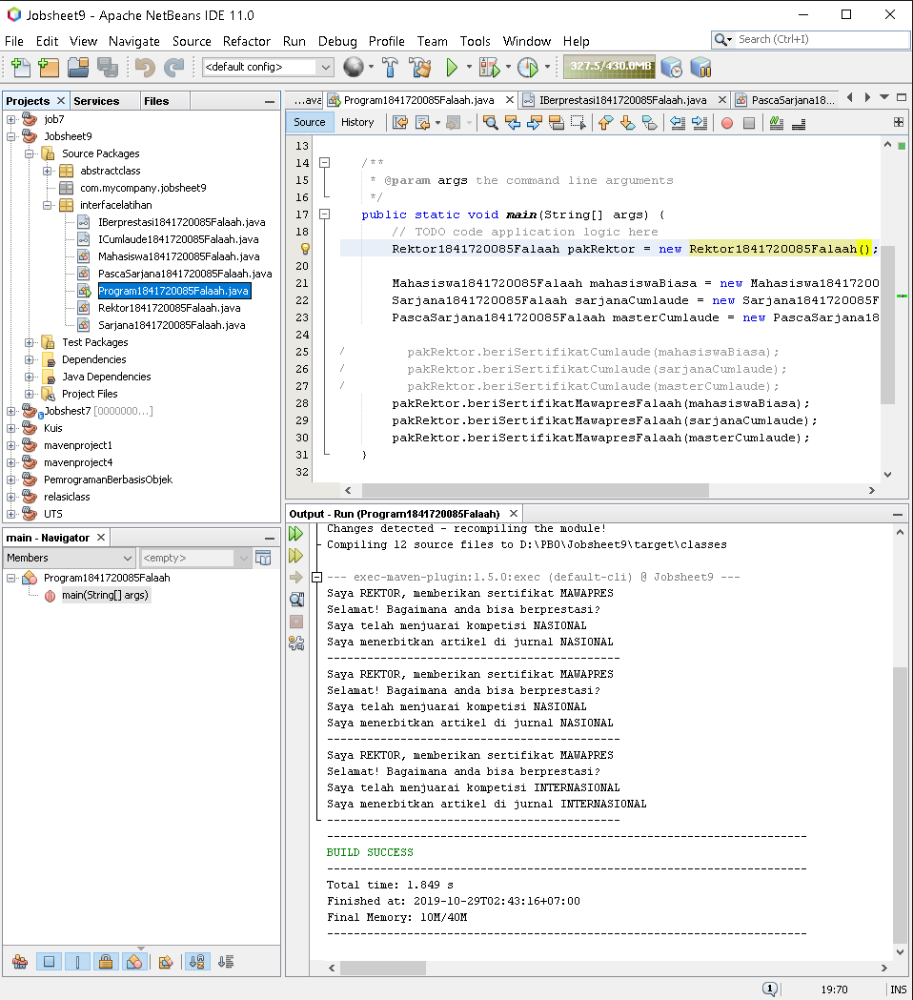
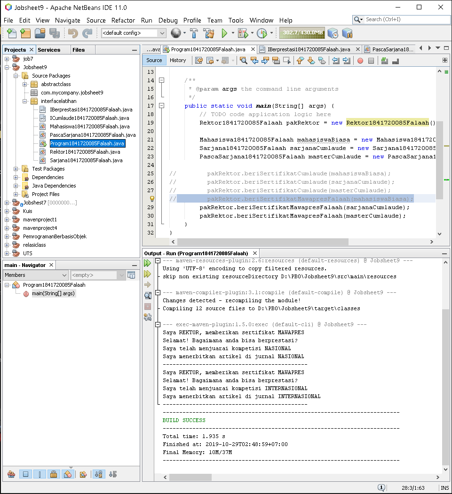

# Laporan Praktikum #9 - Abstract Class dan Interface

## Kompetensi

Setelah menyelesaikan lembar kerja ini mahasiswa diarapkan mampu: 
1. Menjelaskan maksud dan tujuan penggunaan Abstract Class.
2. Menjelaskan maksud dan tujuan penggunaan Interface.
3. Menerapkan Abstract Class dan Interface di dalam pembuatan program. 

## Ringkasan Materi

## Abstract Class

Abstract Class adalah class yang tidak dapat diinstansiasi namun dapat di-extend. Abstract class baru dapat dimanfaatkan ketika ia di-extend.

### Karakteristik

1. Dapat memiliki "properties" dan "methods".
2. Selalu memiliki "abstract methods".
3. Pendeklarasian class menggunakan kata "abstract class".

### Kegunaaan

Menggabarkan hal yang bersifat umum, dan akan dideskripsikan ke dalam bentu yang lebih spesifik lagi.

## Interface

Interface adalah struktur data yang hanya berisi abstract methods. Tidak ada apa-apa selain method abstract pada interface, termasuk atribut getter dan setter.

### Karakteristik

1. Hanya terdapat "abstract methods" di dalammnya.
2. Selalu diawali dengan huruf "I" sebagai penamaannya.
3. Pendeklarasian class menggunakan kata "interface"
4. Terdapat kata "implemets" sebagai penghubung ke class child.

### Kegunaan

Suatu tidakaan yang memiliki syarat yang HARUS terpenuhi untuk suatu class agar
class tersebut dianggap sebagai suatu hal yang baru.

## Percobaan

## Percobaan 1 : Abstract Class

Di dunia ini terdapat banyak jenis hewan. Semua hewan memiliki beberapa karakteristik yang sama, seperti contohnya semua hewan memiliki umur, hewan apapun itu, umurnya akan bertambah sama jumlahnya setiap tahun. 
Selain karakteristik yang sama, masing-masing hewan juga memiliki karakteristik yang berbeda satu dengan yang lainnya. Contohnya dalam hal bergerak. Cara kucing bergerak berbeda dengan cara ikan bergerak. Kucing bergerak dengan cara melangkahkan kaki-kakinya sedangkan ikan bergerak dengan cara menggerakkan siripnya.

Setiap orang yang memelihara hewan dapat mengajak hewan peliharaannya berjalan (membuat agar hewan peliharaannya bergerak). Namun orang yang memelihara hewan yang berbeda, akan berbeda pula cara hewan peliharaannya dalam bergerak. Pada percobaan pertama ini kita akan membuat sebuah program yang menggambarkan skenario di atas dengan memanfaatkan abstract class. 

### Percobaan yang saya lakukan :

Kode Program Hewan : [Klik disini](../../src/9_Abstract_Class_dan_Interface/abstract/Hewan1841720085Falaah.java)

Kode Program Ikan : [Klik disini](../../src/9_Abstract_Class_dan_Interface/abstract/Ikan1841720085Falaah.java)

Kode Program Kucing : [Klik disini](../../src/9_Abstract_Class_dan_Interface/abstract/Kucing1841720085Falaah.java)

Kode Program Orang : [Klik disini](../../src/9_Abstract_Class_dan_Interface/abstract/Orang1841720085Falaah.java)

Kode Program MainProgram : [Klik disini](../../src/9_Abstract_Class_dan_Interface/abstract/Program1841720085Falaah.java)

### Pertanyaan

1. Bolehkah apabila sebuah class yang meng-extend suatu abstract class tidak mengimplementasikan method abstract yang ada di class induknya? Buktikan!

Jawab:

Tidak boleh, karena misalnya pada class Kucing. Dia meng-extends class Hewan, dimana terdapat method abstract “bergerak”. Sehingga pada class kucing harus diimplementasikan method abstract tersebut. 

## Percobaan 2 : Interface

Pada sebuah wisuda, seorang Rektor akan memberikan penghargaan sertifikat Cumlaude pada semua mahasiswa yang memenuhi persyaratan. Persyaratan agar seorang mahasiswa dapat disebut sebagai Cumlaude berbeda-beda antara mahasiswa Sarjana dan Pasca Sarjana. 

Untuk menjadi cumlaude, mahasiswa Sarjana harus mengerjakan skripsi dan memiliki IPK lebih tinggi dari 3,51. Sedangkan untuk mahasiswa Pasca Sarjana, mereka harus mengerjakan tesis dan meraih IPK lebih tinggi dari 3,71. Pada percobaan ini kita akan mencoba menerjemahkan skenario di atas ke dalam sebuah aplikasi sederhana yang memanfaatkan interface. 

### Percobaan yang saya lakukan :

Kode Program ICumlaude : [Klik disini](../../src/9_Abstract_Class_dan_Interface/interface/percobaan2/ICumlaude1841720085Falaah.java)

Kode Program Mahasiswa: [Klik disini](../../src/9_Abstract_Class_dan_Interface/interface/percobaan2/Mahasiswa1841720085Falaah.java)

Kode Program Sarjana : [Klik disini](../../src/9_Abstract_Class_dan_Interface/interface/percobaan2/Sarjana1841720085Falaah.java)

Kode Program PascaSarjana : [Klik disini](../../src/9_Abstract_Class_dan_Interface/interface/percobaan2/PascaSarjana1841720085Falaah.java)

Kode Program Rektor : [Klik disini](../../src/9_Abstract_Class_dan_Interface/interface/percobaan2/Rektor1841720085Falaah.java)

Kode Program MainProgram : [Klik disini](../../src/9_Abstract_Class_dan_Interface/interface/percobaan2/Program1841720085Falaah.java)

### Pertanyaan

1. Mengapa pada langkah nomor 9 terjadi error? Jelaskan!

Jawab : 

Karena pada class mahasiswa belum diimplementasikan ICumlaude. Sehingga tidak bisa mengakses class interface ICumlaude. 

2. Dapatkah method kuliahDiKampus() dipanggil dari objek sarjanaCumlaude di class Program? Mengapa demikian?

Jawab :

Bisa, karena pada class mahasiswa mengimplementasikan class interface ICumlaude

3. Dapatkah method kuliahDiKampus() dipanggil dari parameter mahasiswa di method beriSertifikatCumlaude() pada class Rektor? Mengapa demikian?

Jawab : 

Tidak bisa, karena method kuliahDiKampus() pada class mahasiswa bukan abstract method. 

4. Modifikasilah method beriSertifikatCumlaude() pada class Rektor agar hasil eksekusi class Program menjadi seperti berikut: 

## Percobaan 3 : Multiple Interfaces Implementation 

Pada percobaan kali ini kita akan memodifikasi program yang telah dibuat pada Percobaan 2 sehingga pada program tersebut nantinya akan terdapat sebuah class yang meng-implements lebih dari 1 interface

Bayangkan pada skenario sebelumnya, dimana seorang rektor juga akan memberiSertifikatMawapres() pada sebuah acara wisuda. Mahasiswa yang berhak menerima penghargaan tersebut tentunya adalah mahasiswa yang berprestasi, dimana kriteria prestasi di sini berbeda antara mahasiswa Sarjana dengan mahasiswa Pasca Sarjana. Pada percobaan ini, kita akan menentukan kriteria prestasi yaitu: harus menjuaraiKompetisi() dan membuatPublikasiIlmiah().

### Percobaan yang saya lakukan :

Kode Program IBerprestasi: [Klik disini](../../src/9_Abstract_Class_dan_Interface/interface/percobaan3/IBerprestasi1841720085Falaah.java)

Kode Program ICumlaude: [Klik disini](../../src/9_Abstract_Class_dan_Interface/interface/percobaan3/ICumlaude1841720085Falaah.java)

Kode Program Mahasiswa : [Klik disini](../../src/9_Abstract_Class_dan_Interface/interface/percobaan3/Mahasiswa1841720085Falaah.java)

Kode Program Sarjana: [Klik disini](../../src/9_Abstract_Class_dan_Interface/interface/percobaan3/Sarjana1841720085Falaah.java)

Kode Program PascaSarjana: [Klik disini](../../src/9_Abstract_Class_dan_Interface/interface/percobaan3/PascaSarjana1841720085Falaah.java)

Kode Program Rektor: [Klik disini](../../src/9_Abstract_Class_dan_Interface/interface/percobaan3/Rektor1841720085Falaah.java)

Kode Program MainProgram: [Klik disini](../../src/9_Abstract_Class_dan_Interface/interface/percobaan3/Program1841720085Falaah.java)

### Pertanyaan

1. Apabila Sarjana Berprestasi harus menjuarai kompetisi NASIONAL dan menerbitkan artikel di jurnal NASIONAL, maka modifikasilah class-class yang terkait pada aplikasi Anda agar di class Program objek pakRektor dapat memberikan sertifikat mawapres pada objek sarjanaCumlaude

## Kesimpulan

Dari ke tiga percobaan di atas dapat disimpulkan bahwa, 

1. Abstract Class dapat dipanggil menggunakan "extends" tidak menggunakan "implements" dan selalu dideklarasikan dengan kata "abstract class", serta bolehnya terdapat suatu method dan properties.

2. Inteface Class dapat dipanggil menggunakan "implements" dan apabila terdapat 2 atau lebih Interface Class dapat diimplementasikan hanya menggunkana tanda "," sebagai pemisah. Contoh 
"IBerprestasi, ICumlaude".
Serta di dalam Interface Class hanya terdapat "abstract methods" saja dan selalu dideklarasika dengan kata "interface".

## Pernyataan Diri

Saya menyatakan isi tugas, kode program, dan laporan praktikum ini dibuat oleh saya sendiri. Saya tidak melakukan plagiasi, kecurangan, menyalin/menggandakan milik orang lain.

Jika saya melakukan plagiasi, kecurangan, atau melanggar hak kekayaan intelektual, saya siap untuk mendapat sanksi atau hukuman sesuai peraturan perundang-undangan yang berlaku.

Ttd,

***(Muhammad Falaah Azmi)***
